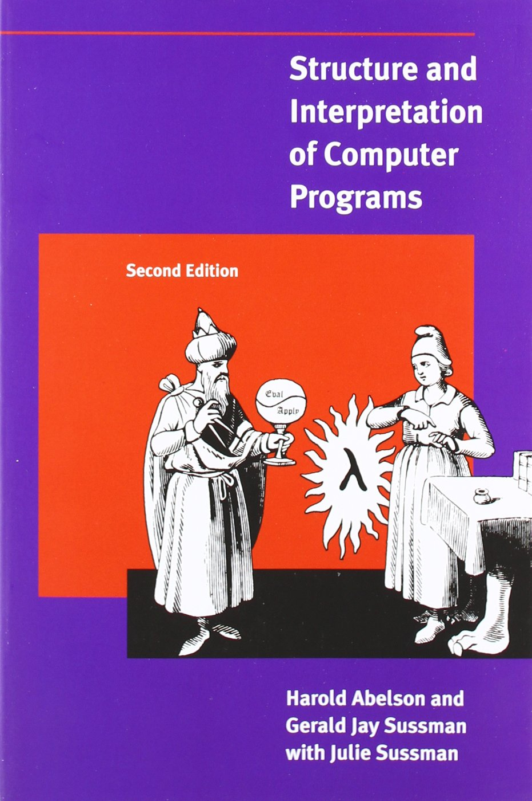
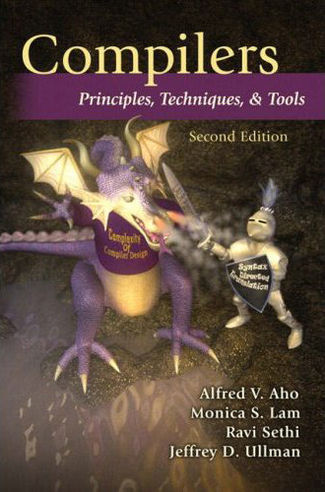
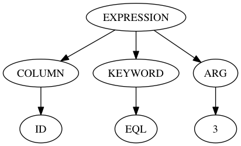
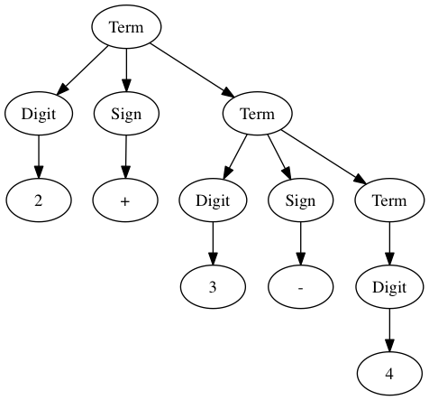
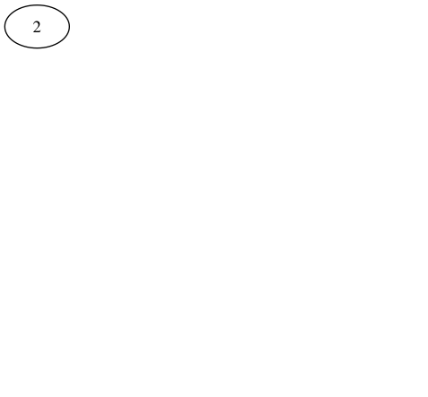
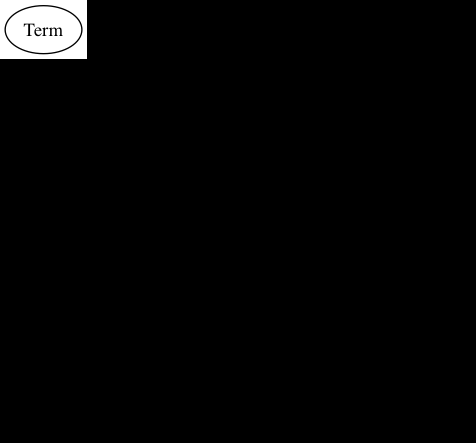
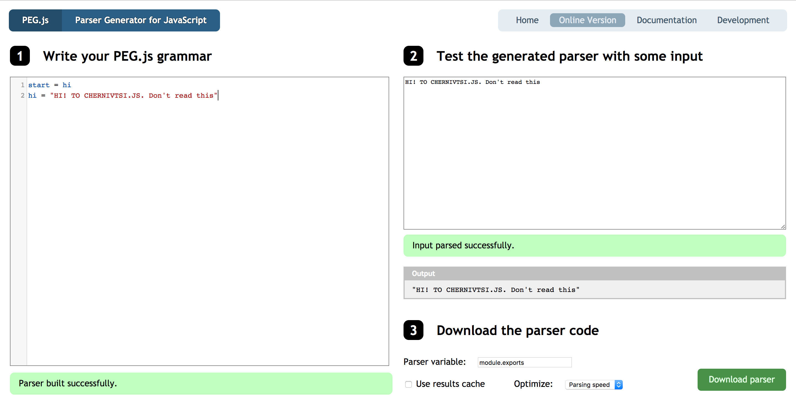
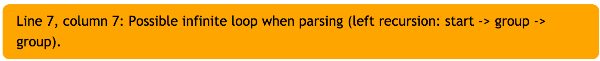
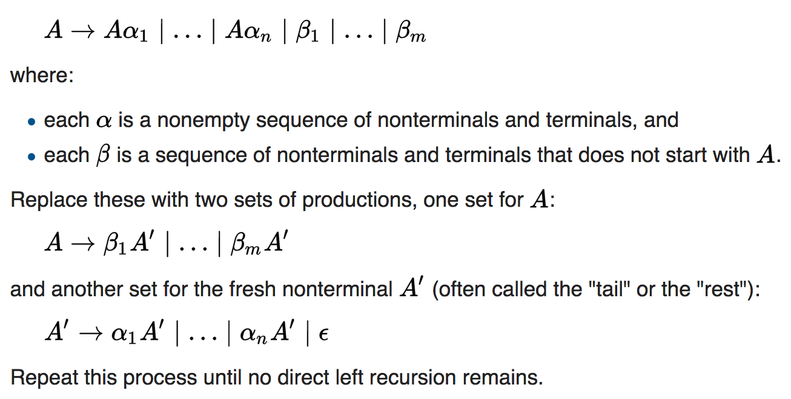

title: Learn peg.js for fun and profit
author:
  name: sudodoki
  email: smd.deluzion@gmail.com
  github: sudodoki
  twitter: sudodoki
theme: sudodoki/reveal-cleaver-theme
output: index.html

--

# Peg.js and custom grammars
<h1 style="text-transform: none">https://git.io/vH1iV</h1>

<style>
.reveal code {
  // font-family: "Joystix";
  font-size: 42px;
  line-height: 46px;
}
</style>
--

# @sudodoki
## Sprint-42
### Formerly RailsReactor
## kottans.org

--

## Task @ RailsReactor
> Let user type SQL-like queries. `<COLUMN> <KEYWORD> <ARGS>`

-- 

## Hm, and how do they actually do it?
## ** JS-devs & CS ** 

-- 

# Cool old books
<p>
  
  
</p>

--

# Talk overview
- theory: common ground & vocabulary
- PEG.js: not a silver bullet, but it works

--

# Part I: theory

--

# Working with text
+ structured – Parsing
+ unstructured – NLP

--

# ALGOL 60
+ Spec comes out in 1960
+ Ned Irons publishes ALGOL parser, based on formal notation

--

# String -> Tokens -> AST / Parse Tree

--

####  "ID = 3" 
↓
#### `[<COLUMN, ID> <KEYWORD, EQL> <ARG, 3>]`
↓
### 

--

# Parsing application
- languages / dsl / data format / custom protocol
- data mining / parsing
- reading language specs
--

# Formal Grammar
+ **T** – terminals
+ **N** – non-terminals
+ **S** – root
+ **R** – production rules

--

# BNF
## Backus–Naur form
```
Letter = 'A' / 'B' / … / 'Z'
Digit = [0-9]
Integer = Digit Integer / Digit
```

--

## Same thing, different production rules
+ `<Name> = [A-Z] [a-z]+`
+ `<Name> = [A-Z] <Letters>`
+ `<Name> = [A-Za-z] <Name>`
+ …

--

## Tokens – product of lexical analysis
### `<name, attribute>` 
+ `<COLUMN, "Id">`
+ `<KEYWORD, "=">`
+ `<ARG, 1>`

--

## Terminals <=> Tokens

--

## Let's talk only context-free grammars

--

# Building parse trees
- Bottom-up
- Top-down
- [Universal]

--

# Sample grammar
```
Start = Term
Digit = [0-9]
Sign = '-' / '+'
Term = Digit Sign Term / Digit
```

--

## Sample tree
### `2 + 3 - 4`


--

## Bottom-up


--

## Top-down


--

# Vanilla JS [Recursive descent](https://git.io/vH1Cn)~ish

--

```js
let result = [];
let curIndex = 0;
const descend = (input) => {
    term(input);
    return result;
}
```

--

```js
const term = (input) => {
 result.push(['term'])
 digit(input);
 if (input[curIndex + 1]) {
   sign(input);
   term(input);
   return
 } else { return } }
```

--

```js
const sign = (input) => {
 const curChar = input[curIndex];
 if (isSign(curChar)) {
  result.push(['sign', curChar])
  curIndex += 1;
 } else {
  throw new 
   SyntaxError(`${curChar||'∅'}\
instead of sign`); } }
```
--

```js
const isSign = (c) =>
  ['+', '-'].includes(c)
const isDigit = (c) =>
  '0123456789'
    .split('')
    .includes(c);
```

--

<pre><code style="font-size: 30px; line-height: 33px" class="lang-js"><span class="hljs-keyword">const</span> parsed = <span class="hljs-built_in">JSON</span>.stringify(descend(<span class="hljs-string">"2+3-4"</span>))
<span class="hljs-built_in">console</span>.log(<span class="hljs-string">'parsed: '</span>, parsed)
<span class="hljs-comment">// parsed:  [["term"],["digit","2"]</span>
<span class="hljs-comment">// ["sign","+"],["term"],["digit","3"]</span>
<span class="hljs-comment">// ["sign","-"],["term"],["digit","4"]]</span></code></pre>


--

# Backtracking
## vs
# Lookahead

--

# Parser approaches
- [shift-reduce](https://en.wikipedia.org/wiki/Shift-reduce_parser)
- [CYK](https://en.wikipedia.org/wiki/CYK_algorithm)
- [Earley](https://en.wikipedia.org/wiki/Earley_parser)
- [Recursive descent](https://en.wikipedia.org/wiki/Recursive_descent_parser)
- [PEG](https://en.wikipedia.org/wiki/Parsing_expression_grammar)
- [Parser combinators](https://en.wikipedia.org/wiki/Parser_combinator)

--

# Other aspects
+ LL / LR / LALR / SLR
+ SAX
+ PEG & linear time => http://bford.info/packrat/
+ Formal grammars and Automatons

--

# Part II: practice

--

## PEG.js as representative of PEG 
### by [@dmajda](https://github.com/dmajda)

--

# When to build a parser
+ when simple regexp is not good enough
+ keeping some context / etc
+ loose syntax / casing

--

## [Peg.js](npmjs.com/pegjs) + [chokidar-cli](https://github.com/kimmobrunfeldt/chokidar-cli)
```
npm i pegjs chokidar-cli
// in package.json scripts
chokidar 'parens.pegjs' 
  --initial 
  --silent 
  -c 'pegjs -o
    parens-parser.js
    parens.pegjs'
```

--

### [https://pegjs.org/online](https://pegjs.org/online)
## Aka 'don't bother with installation'

--

## Basic parsing expressions
+ Terms / Non-terms
+ "literals" / 'literals'
+ `.` - any char
+ [a-z] [0-9] [\u00C0-\u10FFFF] char ranges
+ `*` / `+` / `?` / `()`

--

## Simple parens grammar
```
start = group
lpar = '('
rpar = ')'
nothing = ''
group = 
    lpar group rpar
    / group group
    / ''
```

--



--

## [Eliminating left recursion](https://en.wikipedia.org/wiki/Left_recursion#Removing_left_recursion)


--

 

--

## Going from this…
```
group = 
    lpar group rpar
    / group group
    / ''
```

--

## to this
```
group = lpar rest
  / lpar group rpar
  / ''
rest = ')' group
  / ')'
```

--
## Run action
```js
start = FLOAT
SIGN = "-" / "+"
DIGIT = [0-9]
INTEGER = 
  d:DIGIT int:INTEGER
  { /* other side effect */
    return d + int }
  / d:DIGIT 
  { return d }
```
--
# Helpers
## JS code at top of grammar file

```
{
const notNull = (thing) =>
  thing != null
}
```

--

# Options / context
```
parser.parse(string, options);
```
--

### Predicate
```
FLOAT = sign:SIGN?
  whole:INTEGER? "."?
  fraction:INTEGER? &{
    return notNull(whole)
    || notNull(fraction) 
  }
  { return { sign,
             whole,
             fraction } }
```

--

## Thinking about your grammar
+ case sensitivity
+ loose syntax
+ distinguishing lexemes
+ AST

--

# Avoiding ambiguity
+ in terms of building parse tree
+ in terms of deciding token's type

--

## Two cases
```
"ID" >= (20)
ID less than 20
```

--

### How to tackle Precedence
<pre><code style="font-size:35px; line-height: 37px">// level2 * /
// level1 + -
start = level1
level1 =
    level2 ([+-] level2)+
    / level2
level2 =
    level0 ([*/] level0)+
    / level0
level0 = number / "(" level1 ")"
number = [0-9]+
</code></pre>
--

# Coming up with AST
+ Sequential
+ Non-sequential

--

# Sample AST
```js
{
column: { name, location, type }
keyword: { value, location }
argument: [ { value, location }]
}
```

--

# Non-sequential
<pre><code style="font-size:35px; line-height: 37px">{
 complete: true,
 sequence: [
  { column: { name, location, type }},
  { whitespace: true },
  { keyword: { value, location, type }},
  { whitespace: true },
  { argument: [{ value, location }]}
 ]
}
</code></pre>
--

# Location
## (start / end)
+ offset
+ line
+ column

--

# Validation
+ Syntax error
+ Semantic error

--

# Parsing-on-the-go
## ```ID =```
is a valid expression

--


--

# Possible solutions?
+ ditching peg.js
+ using predicates and complete / non-complete attrs
+ swallowing parse errors and trying to figure out how lethal it is
+ incorporating 'incomplete' grammar

--

<pre><code style="font-size: 17px; line-height: 19px;">progressiveExpression =
  column:column whitespace keyword:keyword whitespace* argument:inprogArgumentList
  { return { complete: false, sequence: [makeColumn(column), makeWhitespace(),
             makeKeyword(keyword), makeWhitespace(), makeArgument(argument) ] }}
  / column:column whitespace keyword:keyword whitespace+
  { return { complete: false, sequence: [makeColumn(column), makeWhitespace(), 
             makeKeyword(keyword), makeWhitespace()] }}
  … 3 redacted
  / column:column { return { complete: false, sequence: [makeColumn(column)] }}
  / inprogColumn  
</code></pre>
--

## Syntax errors and messages
```inprogEntity '' = …```
--

## Prompting is basically
+ manipulating AST
+ stringifying

--

# Ignoring case
```
equalOp = ['equal']i 's'i?
```

--

# What would I redo?

--

# Alternatives
- [Jison](https://zaa.ch/jison/)
- [ANTLR v4](https://github.com/antlr/antlr4/blob/master/doc/javascript-target.md)
- [nearley](https://github.com/Hardmath123/nearley)
- [lpeg](http://www.inf.puc-rio.br/~roberto/lpeg/lpeg.html)
- [jsparse](https://github.com/doublec/jsparse)
- lex / yacc

-- 

## Further reading
+ [Compilers: Principles, Techniques, and Tools](https://www.amazon.com/Compilers-Principles-Techniques-Tools-2nd/dp/0321486811)
+ [Nathan's University PL101: Parsing](https://web.archive.org/web/20161128074002/http://nathansuniversity.com:80/pegs.html)
+ [Parsing: a timeline](http://blogs.perl.org/users/jeffrey_kegler/2014/09/parsing-a-timeline.html)
+ [Chomsky Hierarchy for Languages](https://youtu.be/_ecle_FC6AE)
+ [Compiler Design - Top-Down Parser](https://www.tutorialspoint.com/compiler_design/compiler_design_top_down_parser.htm)
+ [Top-down vs bottom-up](http://blogs.perl.org/users/jeffrey_kegler/2014/11/parsing-top-down-versus-bottom-up.html)
+ [CYK Parsing algorithm](https://www.cs.bgu.ac.il/~michaluz/seminar/CKY1.pdf)
+ [You could have invented Parser Combinators](http://theorangeduck.com/page/you-could-have-invented-parser-combinators)
+ [Earley Parsing Explained](http://loup-vaillant.fr/tutorials/earley-parsing/)