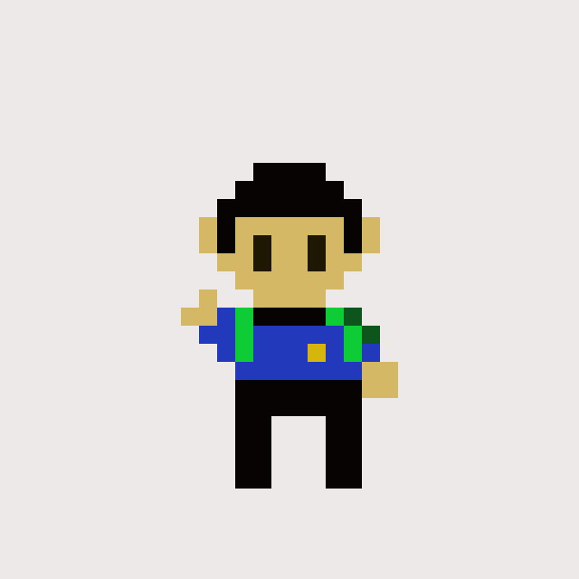
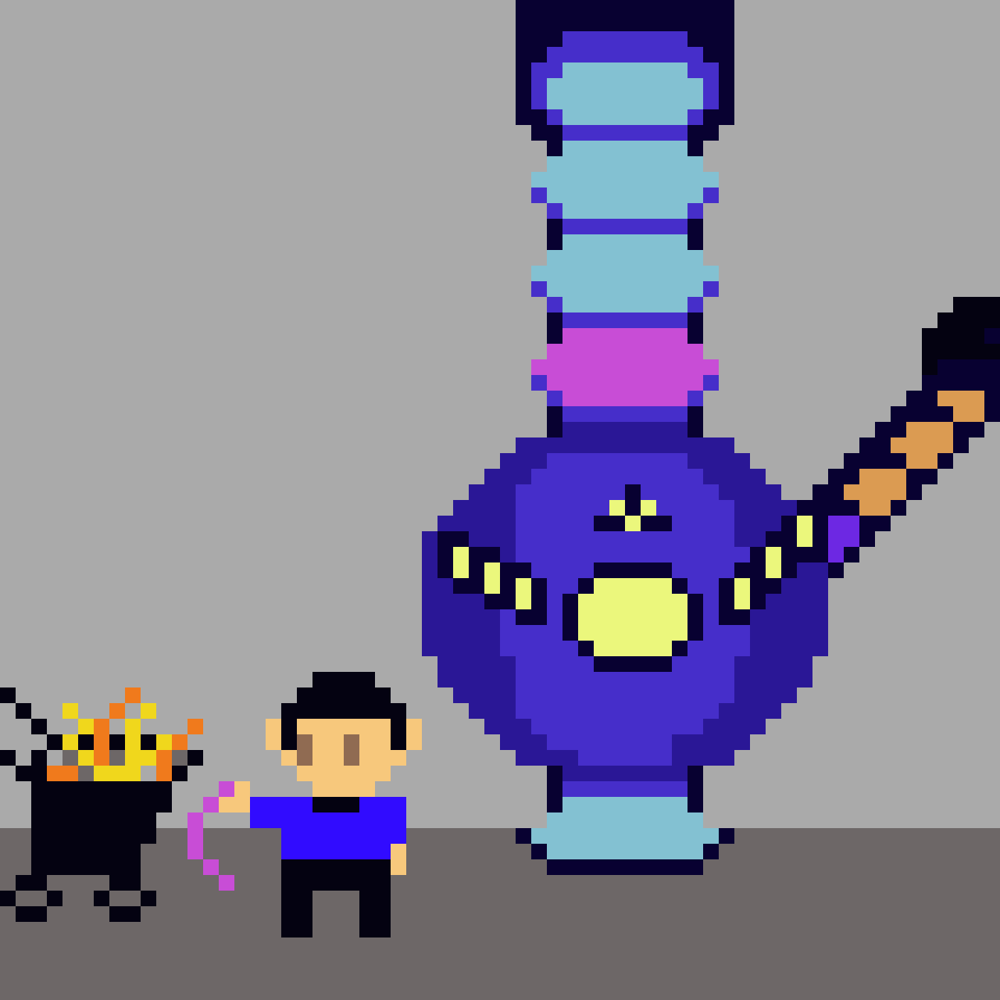
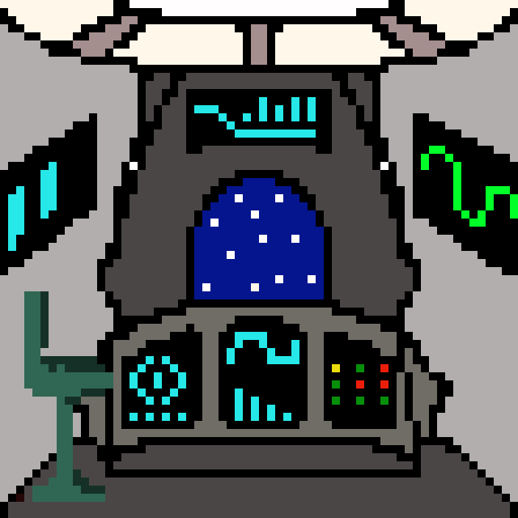
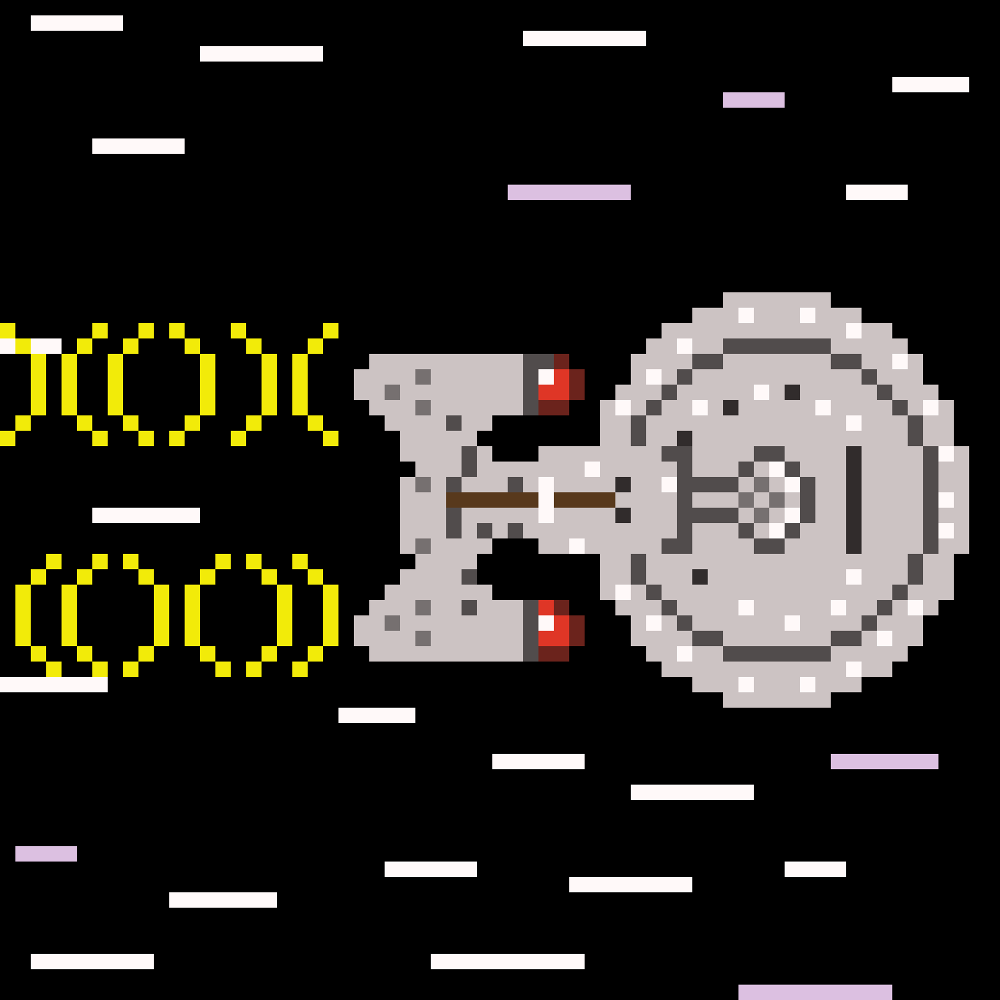

title: Insert Title here
author:
  name: Джон, просто Джон
  github: sudodoki
  twitter: sudodoki
theme: sudodoki/reveal-cleaver-theme-bright
output: index.html

--

<style>
@font-face {
  font-family: "WebUpheavalPro";
  src: url("fonts/Upheaval/UpheavalPro.otf") format("opentype"),
       url("fonts/Upheaval/UpheavalPro.ttf") format("truetype");
}
.reveal code {
  // font-family: "Joystix";
  font-size: 45px;
  line-height: 50px;
}

.reveal h1, .reveal h2, .reveal h3, .reveal h4, .reveal h5, .reveal h6 {
  font-family: "Upheaval Pro", "WebUpheavalPro", "Source Sans Pro", Helvetica, sans-serif;;
}

.reveal .roll {
  vertical-align: middle;
}
.reveal .truncate code,
.reveal .truncate pre {
  display: inline-block;
  width: auto;
}
</style>

## Джон для khjs #1




--

#### Кто такой Джон ~~Галт~~?

+ Тимлид в R⚡️R
+ Соорганизатор [KyivJS](http://kyivjs.org)
+ Котан в [kottans.org](http://kottans.org)

--

### Почему я делаю этот доклад?

+ **Меня пригласили**
+ **Я в очередной раз интересуюсь ClojureScript**
+ **Слежу за языком и вам советую**

--

### Команда "Enterprise"

<div style="margin: 15px 0px;text-align: left; ">
<span class="fragment" style="vertical-align:middle;text-align:center; display: inline-block; width:25%">Your Generic language</span>
<span class="fragment" style="text-align:center; display: inline-block; width:18%">Java</span>
<span class="fragment" style="text-align:center; display: inline-block; width:15.5%">Haskell</span>
<span class="fragment" style="text-align:center; display: inline-block; width:21.5%">Clojure</span>
<span class="fragment" style="text-align:center; display: inline-block; width:12%">JS</span>
<span class="fragment" style="text-align:center; display: inline-block; width:12%;margin-left: -125px;">––</span>
</div>
<span class="fragment">В данной аналогии JS = двигатель корабля</span>

--

# ClojureScript
+ "Младший брат" Clojure
+ Clojure использует JVM / CLR / JS как хост
+ Минус вещи для работы с многопоточностью

--

## Простота vs Легкость
Рич Хикки топит за простоту, а [кложура делает её легкой](https://www.infoq.com/presentations/Simple-Made-Easy)

--

### Также в номере
+ Воспитание функционального мышления
+ Фронтенд на cljs = пуля в борьбе с JS снобами
+ Иммутабельность по дефолту
+ Практичность и разумные компромиссы
+ Встраиваемость
+ Комьюнити
+ Эксперименты
+ Кладезь для идей

--

## Синтаксис



--

> Тут у меня if и выполнится эта ветка, но скобочек нет, значит выполнится только первое выражение из неё, а эти выражения тогда что?


--

```js
/*
<Str>
  <p>hello</p>
  <p>world</p>
</Str>
*/
```
--
```js
React.createElement(
  Str, null,
    React.createElement(
      'p', null, 'hello'
    ),
    React.createElement(
      'p', null, 'world'
    ))
```

--

```clojure
;function      arg2   arg3
;↓              ↓      ↓
(+      1       2      3)
(str "hello" "world")
;       ↑
;      arg1
```


--

## Вложенность
```clj
(def r 5)
(defn square [x] (* x x))

(* (.-PI js/Math) (square r))
```
--

```clj
(map #(* (.-PI js/Math)
         (square %))
      [1 2 3])

(map (fn [radius]
        (* (.-PI js/Math)
           (square radius)))
     [1 2 3])
```

--

Список 
<div class="truncate"><pre><code>(1 2 3)</code></pre></div>
Вызов функции
<div class="truncate"><pre><code>(fn arg1 arg2)</code></pre></div>

--

## Постойте…


--

# Код = Данные


--

# Система макросов
## для расширения языка

--

# Простые типы
+ Числа `5`, `12.15`, `3/10`
+ Ключевые слова `:when`, `:id`, `:foobar`
+ Символы `my-fn`, `my-var`, `+`, `/`
+ Строки `"Hello"`, `"World"`
+ Буквы `\newline`, `\a`

--

## Основные коллекции
+ Списки `(list 1 2 3)`, `'(1 2 3)`
+ Векторы `(vector 1 2 3)`, `[1 2 3]`
+ Хеш-таблицы `(hash-map :a 1 :b 2)`, `{:a 1 :b 2}`
+ Множества `(set '(1 2 3))`, `#{1 2 3}`

--

> Зачастую то, что работает на одном типе коллекции – будет работать и на других

--

## Иммутабельность


--

```clj
; Ignoring other *JS
(def cityjs
  {:kharkiv ["KharkivJS"]})
```
--
```clojure
(assoc cityjs
  :kharkiv
  (conj
    (:kharkiv cityjs)
    "KhJS"))
; => {:kharkiv
;     ["KharkivJS" "KhJS"]}
```

--
```clj
(update-in cityjs
  [:kharkiv]
  #(conj % "KhJS"))
; => {:kharkiv 
;     ["KharkivJS" "KhJS"]}

```
--

## Преимущества
+ производительность структур и их сравнения
+ общие структурные элементы

--

## Функции и ФП
+ функции как объекты первого класса
+ композиция, частичное применение
+ поддержка нескольких арностей
+ диспатчинг по функции

--

```clojure
(defn greet
    ([salute]
        (greet salute "world"))
    ([salute who]
        (println salute who)))
; cljs.user=> (greet "hey")
; hey world
; nil
```

--

```clojure
(defmulti refactor :framework)
; same as
; (defmulti refactor
;           #(% :framework))
```
--
```clojure
(defmethod refactor :angular
  [{name :name}]
  (println "Rewrite"
           name
           "in react"))  
```
--

```clj
(refactor {
  :framework :angular
  :name "My TODO App"})
; Rewrite My TODO App in react
; nil
```

--

## In -| transform |-> Out

<blockquote style="text-align: left">Вообще, в итоге построение программы сводится к тому, чтобы придумать, какую структуру данных вы получаете на входе, какую вы хотите получить на выходе и написать трансформацию на основании функций, что превратит первое во второе</blockquote>
--

## Практичность
+ Вещи, которые считаются плохими, делаются явными (мутации и !, …)
+ Доступ к хост платформе `(.random js/Math)`
+ При принятии решения "умное/чистое vs практичное" – выбирают практичное

--

## Дайте мне точку входа и я весь переколбашу проект`*`
`*` – предполагаем, что у вас Leiningen

--
project.clj
<pre><code style="font-size:28px;line-height: 32px">(defproject color-clock "0.1.0-SNAPSHOT"
  :description "FIXME: write this!"
  :dependencies [
    [org.clojure/clojure "1.8.0"]
    [org.clojure/clojurescript "1.9.456"]
    [reagent "0.6.0"]]
  :jvm-opts ^:replace ["-Xmx1g" "-server"]
  :plugins [[lein-npm "0.6.1"]]
  :npm {:dependencies [[source-map-support "0.4.0"]]}
  :source-paths ["src" "target/classes"]
  :clean-targets ["out" "release"]
  :target-path "target")
</pre></code>
--

## Как такой получить?
+ написать руками
+ сделать lein new %template% project-name

--

## %template%
+ [mies](https://github.com/swannodette/mies)
+ [reagent](https://github.com/reagent-project/reagent-template)
+ [luminus](http://www.luminusweb.net/)
+ [macchiato](https://macchiato-framework.github.io/)

--

## Работа с DOM
+ Google Closure library
+ jQuery
+ React wrapper ([Om](https://github.com/omcljs/om), [Quiescent](https://github.com/levand/quiescent), [Reagent](http://reagent-project.github.io/), [Rum](https://github.com/tonsky/rum))

--

<!--```clojure
(defn clock-page []
  (let [cur-time (r/atom (get-current-time))]
    (add-watch cur-time :seconds println)
    (fn []
      (js/setTimeout
        #(reset! сur-time (get-current-time)) 1000)
      [:div {:class "holder" 
             :style {"backgroundColor"
                     (time-to-rgb @current-time)}} 
        [:h1 (interpose ":" @current-time)]])))
;; Initialize app
(r/render [clock-page]
  (.getElementById js/document "app"))
```-->

<pre><code class="lang-clojure" style="font-size: 28px; line-height: 32px;">(<span class="hljs-name"><span class="hljs-builtin-name">defn</span></span> clock-page []
  (<span class="hljs-name"><span class="hljs-builtin-name">let</span></span> [cur-time (<span class="hljs-name">r/atom</span> (<span class="hljs-name">get-current-time</span>))]
    (<span class="hljs-name"><span class="hljs-builtin-name">add-watch</span></span> cur-time <span class="hljs-symbol">:seconds</span> println)
    (<span class="hljs-name"><span class="hljs-builtin-name">fn</span></span> []
      (<span class="hljs-name">js/setTimeout</span>
        #(<span class="hljs-name"><span class="hljs-builtin-name">reset!</span></span> сur-time (<span class="hljs-name">get-current-time</span>)) <span class="hljs-number">1000</span>)
      [<span class="hljs-symbol">:div</span> {<span class="hljs-symbol">:class</span> <span class="hljs-string">"holder"</span> 
             <span class="hljs-symbol">:style</span> {<span class="hljs-string">"backgroundColor"</span>
                     (<span class="hljs-name">time-to-rgb</span> @current-time)}} 
        [<span class="hljs-symbol">:h1</span> (<span class="hljs-name">interpose</span> <span class="hljs-string">":"</span> @current-time)]])))
(<span class="hljs-name">r/render</span> [clock-page]
  (<span class="hljs-name">.getElementById</span> js/document <span class="hljs-string">"app"</span>))</code></pre>

--

## let он и в Африке let
```clojure
(let [somevar "somevalue"]
  (use-local-binding somevar))
```

--

# Atom

```clojure
(def answer (atom 42))
(println (deref answer))
(println @answer) ; => 42
(swap! answer #(* 2 %)) ; => 84
(compare-and-set! answer 42 13)
; => false
(reset! answer 42) ; => 42
```
using reagent/atom to get automagical rerendering
--

# Markup
```clojure
[:div
  {:class "holder" 
   :style {
     "backgroundColor"
      (time->rgb @cur-time)}} 
  [:h1 (interpose ":" @cur-time)
]]
```
Хотите просто хтмл – [enlive](https://github.com/cgrand/enlive) 
--

```clojure
(ns color-clock.core
  (:require
    [reagent.core :as r]
    [goog.string :as str]))
```       
Имя неймспейса ↔ путь к файлу  
Поэтому, в примере выше src/color_clock/core.cljs

--

<pre><code class="lang-clojure" style="font-size: 28px; line-height: 32px;">(<span class="hljs-name"><span class="hljs-builtin-name">defn</span></span> clock-page []
  (<span class="hljs-name"><span class="hljs-builtin-name">let</span></span> [cur-time (<span class="hljs-name">r/atom</span> (<span class="hljs-name">get-current-time</span>))]
    (<span class="hljs-name"><span class="hljs-builtin-name">add-watch</span></span> cur-time <span class="hljs-symbol">:seconds</span> println)
    (<span class="hljs-name"><span class="hljs-builtin-name">fn</span></span> []
      (<span class="hljs-name">js/setTimeout</span>
        #(<span class="hljs-name"><span class="hljs-builtin-name">reset!</span></span> сur-time (<span class="hljs-name">get-current-time</span>)) <span class="hljs-number">1000</span>)
      [<span class="hljs-symbol">:div</span> {<span class="hljs-symbol">:class</span> <span class="hljs-string">"holder"</span> 
             <span class="hljs-symbol">:style</span> {<span class="hljs-string">"backgroundColor"</span>
                     (<span class="hljs-name">time-to-rgb</span> @current-time)}} 
        [<span class="hljs-symbol">:h1</span> (<span class="hljs-name">interpose</span> <span class="hljs-string">":"</span> @current-time)]])))
(<span class="hljs-name">r/render</span> [clock-page]
  (<span class="hljs-name">.getElementById</span> js/document <span class="hljs-string">"app"</span>))</code></pre>

--

## За кадром
+ комьюнити (спасибо [@roman01la](http://twitter.com/roman01la), [@lambdadmitry](https://twitter.com/lambdadmitry), [clojurians](http://clojurians.net))
+ новый синтаксис взмахом макроса ([csp](https://github.com/clojure/core.async), [типы](https://github.com/clojure/core.typed), [логическое программирование](https://github.com/clojure/core.logic))
+ [clojure.spec](https://clojure.org/about/spec)
+ эксперименты
+ богатая экосистема

--


<br/>
<br/>


--
## Continue? Y/N
