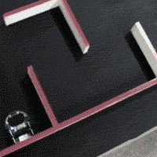

title: My Slideshow
author:
  name: Джон, просто Джон
  twitter: sudodoki
output: index.html
theme: sudodoki/reveal-cleaver-theme

--

### Maze: because I can (not) solve one

<div class="no-uppercase">
<h2>[http://git.io/v8cHt](http://git.io/v8cHt)</h2>
<h2>[@sudodoki](http://twitter.com/sudodoki)</h2>
</div>
--

# Ожидания от презентации

## “Вообще, получилось неплохо”
<h3 class="fragment">
 — моя мама.
</h3>

--
## Техническая сложность:  ⭐️⭐
<h3 class="fragment">
(потому что тут нельзя ставить ползвезды)
</h3>
--
<style type="text/css">
  .no-uppercase a {
    text-transform: none;
  }
  .plain-image img {
    background: transparent!important;
    border: none!important;
  }
  .half {
    width: 50%;
    float: left;
  }
</style>
## Развлекательность:  ⭐️⭐️
<h1 class="fragment with-petrosyan">
   <span>?</span>
</h1>
--
## Позновательность: ⭐⭐⭐*
<h3 class="fragment">* — кореллирует с вашим возрастом</h3> 

--

# Агенда:
0. Вступление
1. Random
2. Абстрактные стартапы в вакууме
3. Возможные способы решения лабиринтов
4. Демо?

--
# Кто я такой
<div class="half plain-image">
  alex.lapshyn@railsreactor.com
  
</div>
<div class="half plain-image">
  kottans.org@gmail.com
  
</div>
--
# [KyivJS](http://kyivjs.org.ua)

--
## Секунду о городе
<div class="fragment">
  Ожидания
</div>
<div class="plain-image">
    
  
</div>

--

<div>Реальность</div>
<div class="plain-image">
  
</div>

--
## Просторная площадь

--

<div class="fragment">Ищи имя штуковины на руке</div>
<div class="fragment">Если оно стерлось, то это губка Менгера</div>
--

--
##[A]maze
<div class="fragment">

</div>
--
### Всем известные лабиринты
+ Дедаловский лабиринт на Крите, в котором Минос прятал Минотавра
+ Живые лабиринты в Англии — король Генрих II и Вудсток
--
## Сад расходящихся тропок
### Хорхе Луис Борхес
--
## Про решение держаться одной рукой за стену
<div class="fragment">
<h4>Проблема четырех красок</h4>
</div>
--

--
# Делаем стартап про лабиринты
## Поиск решенья с помощью…
--
### Поиск решенья с помощью…
## плесени
<iframe width="500" height="380" src="http://i.imgur.com/4dpbdyH.gifv"></iframe>
--
### Поиск решенья с помощью…
## роботов — Micromouse Robots Contest

--
### Поиск решенья с помощью…
## рук
<ul>
<li>своих/наемных</li>
<li class="fragment">чужих/краудсорсинг</li>
<li class="fragment">облачных</li>
</ul>
--
### Про краудсорсинг
Нужно будет построить платформу для ввода/аппрува решения
--
### Про облачные руки
## Mechanical Turk

--
### Поиск решенья с помощью…
## кода
<ul>
<li class="fragment">ML?</li>
<li class="fragment">Нейронные сети?</li>
<li class="fragment">Обычные задачи на графах!</li>
</ul>
--
### Последовательность действий
+ Уже имея лабиринт
+ Ввод лабиринта
+ Визуализация решения <span class="fragment">— crude canvas</span>
--
## Уже имея лабиринт
+ Волновой алгоритм
+ A*
--

--
## Ввод лабиринта
+ Фото <span class="fragment">— getUserMedia</span>
+ Файл <span class="fragment">— FileReader</span>
--

# [Demo](photo-maze)

--
# ~8hrs
<ol>
  <li class="fragment">Canvas & setting width/height</li>
  <li class="fragment">Setting width/height for canvas</li>
</ol>
```
let width = img.naturalWidth;
let height = img.naturalHeight;
canvas.width = width;
canvas.height = height;
```
--
# Итог по стартапу в вакууме
--
## Бизнес-модель — скорее всего, важна
--
<h2>
  <span class="fragment">Почти</span>
  любой опыт — это полезно
</h2>
+ Прототипы => опыт + наработки
+ Краудсорсинг платформа -> коллективные оекаки, коллаборейтив рисунки
+ Код для лабиринтов -> топо{логич,графич}еские задачи
--

--
# Not sure, but Q&A?
