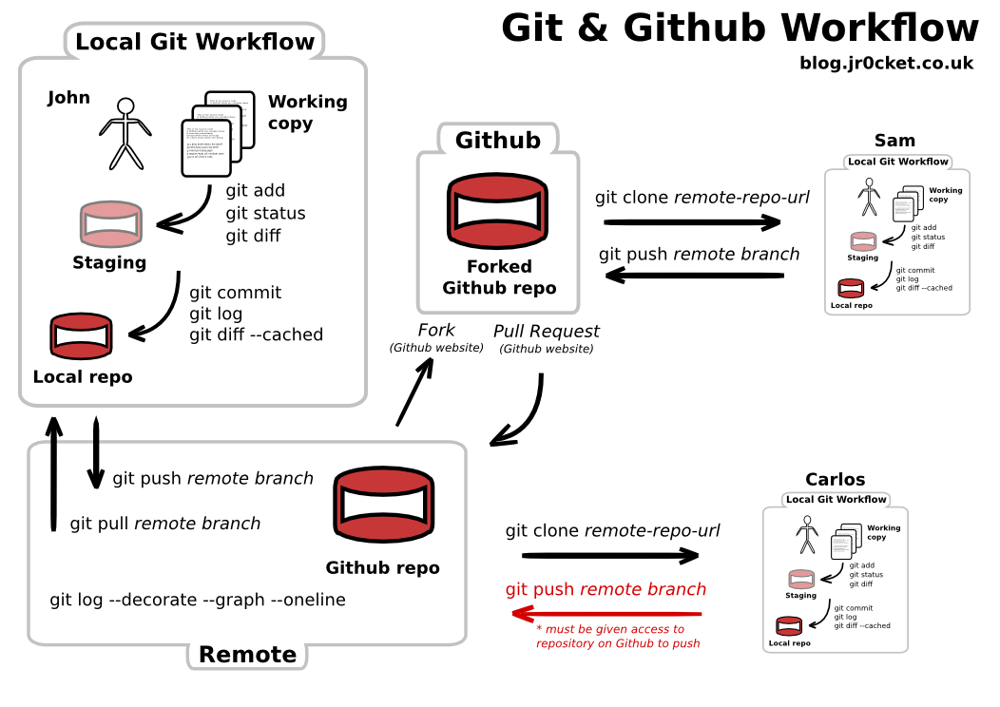

title: Несколько вещей
author:
  name: Александр Лапшин
  twitter: sudodoki
  email: smd.deluzion@gmail.com
theme: sudodoki/reveal-cleaver-theme-bright
output: index.html

--

## Несколько вещей
### о которых мне не рассказывали в университете

--

## Кто я?
+ Выпускник ФИСИТ 2013 года (экономическая кибернетика)
+ Team Lead в <span style="color: #C24C39">RailsReactor</span>
+ Работал в разных компаниях (продуктовая, большой энтерпрайз ~30k человек, аутсорсинг)

-- 

## Готовит ли университет к тому, что ждет на работе?

--

## Не во всем <sup>*</sup>
`*` – говорю с точки зрения своего опыта в веб-разработке

--

## Работа в команде
+ работа с кодом
+ работа с людьми
+ работа с требованиями

--

# Код
+ нужно писать
+ запускать / отлаживать
+ централизированно хранить

--

## Писать можно
+ 'oldschool' (vim / emacs)
+ в редакторе (atom / ms code / sublime text / …)
+ в IDE (jetbrains / ms / …)

--

## Ваше окружение
+ DE / window manager (xmonad, amethyst)
+ terminal (guake, iterm2)
+ shell (bash, zsh)

--

>Плюсом будет иметь базовое представление об этом всем и чувствовать себя продуктивным

--

# VCS 
> системы контроля версий

+ git
+ svn
+ mercurial
+ …
--
<style>.reveal .present img { border: none; }</style>


--

## Концепции, что помогут говорить о гите
1. patch
2. commit
3. branch
4. remote

--

# Patch, ч.1.

```
  >cat program.txt 
  Тервер
  Физ-ра
  Региональная экономика
  >echo "Английский язык" >> program.txt 
```

--

# Patch, ч.2.

`>git diff`

```diff
diff ‑‑git a/program.txt b/program.txt
index d9437f0..c636d0e 100644
‑-- a/program.txt
+++ b/program.txt
@@ -1,3 +1,4 @@
Тервер
Физ-ра
Региональная экономика
+Английский язык
```

--

```
>echo "БЖД" > program.txt
>git diff
```

```diff
diff ‑‑git a/program.txt b/program.txt
index c636d0e..87d1cfb 100644
‑-- a/program.txt
+++ b/program.txt
@@ -1,4 +1 @@
-Тервер
-Физ-ра
-Региональная экономика
-Английский язык
+БЖД
```

--

# Commit
Идентификатор патча <sup>*</sup> в череде патчей. Имеет информацию об авторе / описание / ссылку на родительский патч
`>git cat-file -p 6c339fc5dcb0fac47e62f51cffa353c747a1466f`

```git
tree b42c92498b5dff10fc5c64fcc3b5a1d059bd2a20
parent f58424ee4a12db9bcb0d61eb62ae9a2dcdf2c054
author sudodoki <smd.deluzion@gmail.com> 1491167094 +0300
committer sudodoki <smd.deluzion@gmail.com> 1491167094 +0300

Adding english```

--

# Branch
Параллельные ветки изменений
```
*   98798d0 -  Merging comp-sci (HEAD -> master)
|\  
| * db47fde -  comp-science specific things (comp-sci)
* | 9b41b04 -  analytics specific things (system-analysis)
|/  
* 6c339fc -  Adding english
* f58424e -  Adding initial base for program
* 172d364 -  Initial commit
```

--

# Remote
Удаленный git сервер, куда можно отправить изменения и откуда их можно стянуть

--

## git hosting platforms


--

# Provides
+ git hosting
+ manaing branches / collaborators
+ merge (pull) requests / code review tools
+ documentation / code preview
+ project / code discovery

--



--

## Поделать
+ http://learngitbranching.js.org/
+ https://guides.github.com/activities/hello-world/
--

## Инженерные практики
+ код ревью
+ парное программирование
+ ci / cd
+ tdd
+ …

--

## Работа в команде
+ ✅ работа с кодом
+ работа с людьми
+ работа с требованиями

-- 

# Soft skills

--

# Проактивность

--

## Часто новички боятся задавать вопросы

--

# Коммуникация
> Просто сидеть и писать код недостаточно

--

## Нужно
+ уметь слушать
+ уметь убеждать
+ уметь взаимодействовать

--

## Умение планировать / дисциплина

--

# Почитать
+ The 7 Habits of Highly Effective People (Steven Covey)
+ Emotional Intelligence (Daniel Goleman)

--

## Работа в команде
+ ✅ работа с кодом
+ ✅ работа с людьми
+ работа с требованиями

--

## Конечная цель – 
# нужный кому-то продукт

--

## Нужный
+ нашим пользователем
+ нашему заказчику

--

### Каждый из нас чуть-чуть
+ бизнес аналитик
+ ux дизайнер
+ пользователь

--

## Специфика получения требований
+ формулировки абстрактны, ответы неточны
+ у заказчика нет представления о техничной стороне вопроса
+ больше одного stakeholder'а – разные мнения

--

# Необходимо
+ уметь видеть логические противоречия, изъяны
+ уметь ставить уточняющие вопросы
+ "лучший код – ненаписанный код"
+ не все проблемы решаются кодом
+ в идеале, фиксировать решения в письменном виде

--

## Проблемы недопонимания ⇒
## зря потраченная работа / деньги

--

## Заказчик иностранный ⇒ нужен английский

--

## Имея требования, нужно ставить задачи
+ нетехнические требования ⇒ технические задачи
+ нужно уметь декомпозировать

--

## Отдельная большая часть разработки – планирование и управление рисками

--

## [Разные методологии и практики](https://en.wikipedia.org/wiki/Software_development_process)
+ [scrum](https://en.wikipedia.org/wiki/Scrum_(software_development))
+ [kanban](https://en.wikipedia.org/wiki/Kanban_(development))
+ [waterfall](https://en.wikipedia.org/wiki/Waterfall_model)
+ …

--


--

## Важно помнить, что процессы менее важны, чем люди

--

# Поиск работы

--

## Что вообще происходит в Киеве?
+ [dou.ua junior-digest](https://dou.ua/search/?q=junior+digest)
+ [jobs.dou.ua](https://jobs.dou.ua/)

--

## Сложно и спрос < предложения

--

## Что можно сделать?
+ схватывать на лету и убедить в этом работодателя
+ выбирать сферы с более высоким порогом входа
+ проходить курсы
+ иметь портфолио, даже если это учебные проекты

--

## Что вас могут спрашивать
+ алгоритмы
+ паттерны
+ да что угодно, в принципе

--

## Задачи на интревью !== заданиям на работе

--

## Что вам спрашивать на собеседовании?
+ чему и кто меня будет учить
+ когда я получу следующий "уровень"
+ как компания помогает развиваться сотрудникам


--

## нетворкинг

--

## локальные комьюнити / митапы
+ https://www.meetup.com/
+ [kyivpy](https://www.meetup.com/uapycon/), [kyivjs](http://kyivjs.org/), [rubymeditation](http://www.rubymeditation.com/), [kievfprog](http://kievfprog.net/), …
+ студенческие [itkpi](http://itkpi.pp.ua/), [ShevIT](https://vk.com/shev_it), ФИС.IT?

--

# Бонус
+ https://www.grammarly.com/
+ http://www.dungeonsanddevelopers.com/
+ https://teachyourselfcs.com/
+ https://www.coursera.org / https://www.edx.org/courses
+ http://www.codeschool.com/courses
+ http://htmlacademy.ru
+ http://codewars.com
+ https://checkio.org/
…
--

…
+ [515 Free Online Programming & Computer Science Courses You Can Start in April](https://medium.freecodecamp.com/515-free-online-programming-computer-science-courses-you-can-start-in-april-8b0ce1817d61)
+ https://summerofcode.withgoogle.com/
+ http://csds.ucu.edu.ua/
+ если лень/страшно ходить на встречи – начните с чатов: [список](https://github.com/mr-mig/ru-tech-chats), [dev-ua комьюнити](https://github.com/dev-ua/)
+ ах, ну и да, главные инструменты поиска решений - [SO](http://stackoverflow.com/), [advanced google](https://blog.hubspot.com/blog/tabid/6307/bid/1264/12-quick-tips-to-search-google-like-an-expert.aspx)
--

## Если есть вопросы / предложения / идеи – пишите
### Спасибо за внимание.
### Мне было бы приятно, если бы вы дали [обратную связь](https://goo.gl/forms/aO7Uejpp39X2D9pu1)

