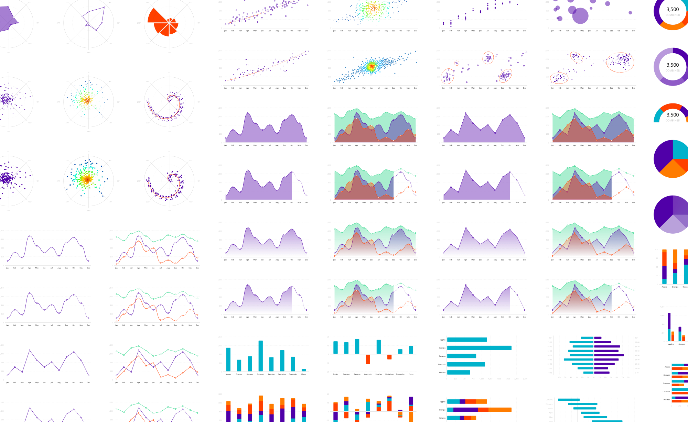
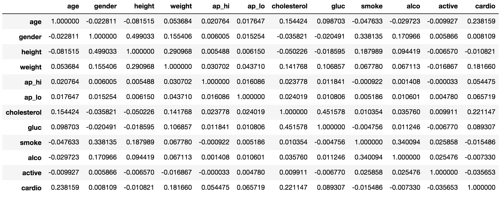
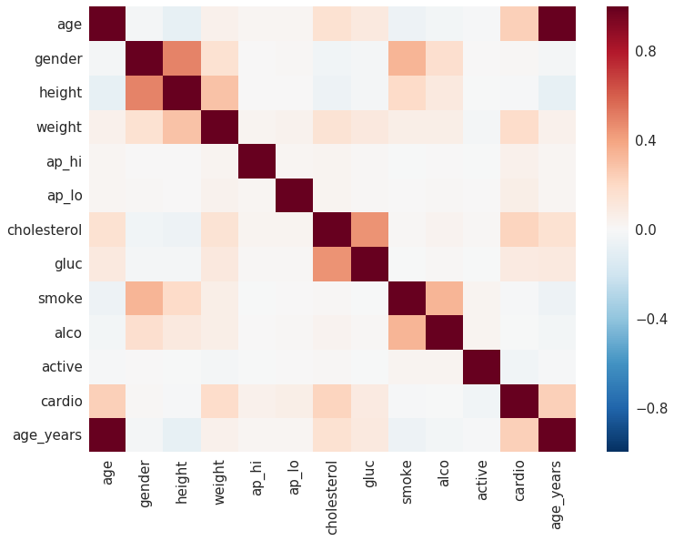
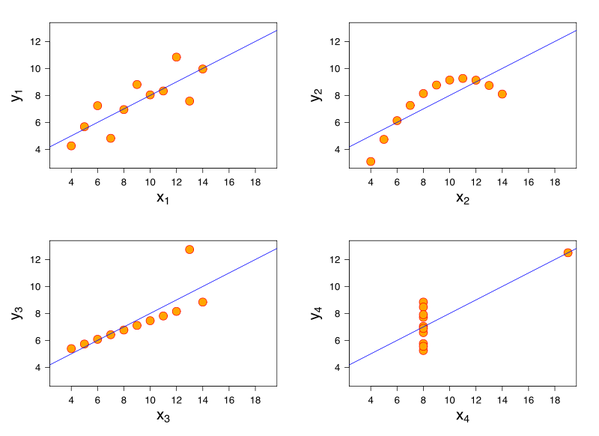
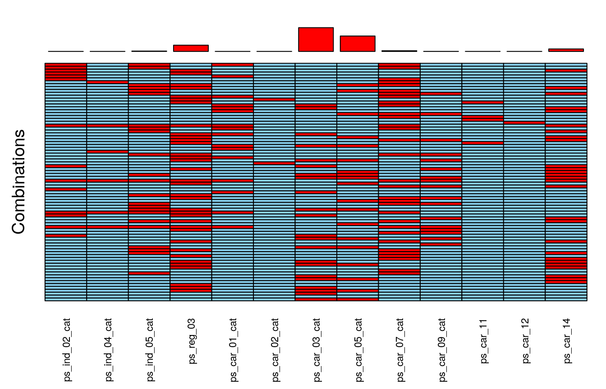
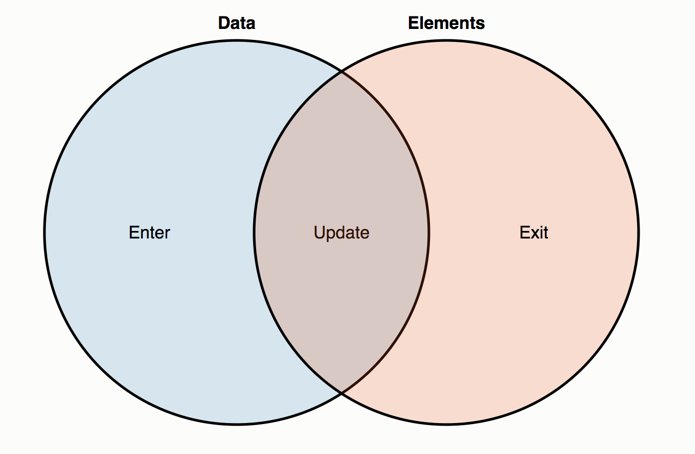

title: Kottans Lecture Visualization
author:
  name: sudodoki
  email: smd.deluzion@gmail.com
  github: sudodoki
  twitter: sudodoki
theme: sudodoki/reveal-cleaver-theme
output: index.html

--

--
# Why do we create visualizations?

--

- art / media
- story telling
- data analysis
- alternative / comprehensive data representation
- insights
- emerging patterns
- exploratory data analysis

--

<iframe width="1062" height="600" src="https://www.youtube.com/embed/wFEbTxgcIRg?rel=0&amp;controls=0" frameborder="0" gesture="media" allow="encrypted-media" allowfullscreen></iframe>

--

## Alternative data representation

--

--

## EDA

--

### Insights 

--

## Generic relations we are trying to tie together
+ numerical
+ categorical
+ temporal
+ spatial

--

# Sample tools
- BI tools
- Static charts / Python / R packages
- Javascript & interactive plots

--

# Things to consider

--

# Things to consider
- supported types of visualization
- supported platforms
- aesthetics / theming
- licensing / pricing
- adapters for your framework
- does data stay on the client or is transfered somewhere?

--

# The way you use solution

--

# The way you use solution
- prebuilt
- JSON / configs
- DSL

-- 

## Types of visualization
- Charts
- Maps
- Workflow / logical circuits
- Trees
- Miscelanious

--

## Type of charts
<iframe width="100%" style="min-height:500px" src="https://www.highcharts.com/demo" frameborder="0"></iframe>

--

## Popular solutions
### (doesn't mean will fit your project)
- %any chart solution%
- plain html / svg / canvas
- D3
- Leaflet for maps
- Three.js for webgl things
- plumber.js for workflows

--

# D3

--

# @mbostock 
+ protovis
+ d3
+ [observablehq.com](http://observablehq.com)

--

## [D3 Gallery](https://github.com/d3/d3/wiki/gallery)

--

# Main parts
+ data utils
+ stats utils
+ scales
+ axis
+ selections / render
+ interactions
+ layouts

-- 
 

--

# [Scales](https://github.com/d3/d3-scale/blob/master/README.md)

--

# Wrappers
+ [nvd3](https://github.com/novus/nvd3)
+ [c3](https://github.com/c3js/c3)

--

# Resources
+ [egghead's d3 course](https://egghead.io/courses/build-interactive-javascript-charts-with-d3-v4)
+ [official wiki](https://github.com/d3/d3/wiki)