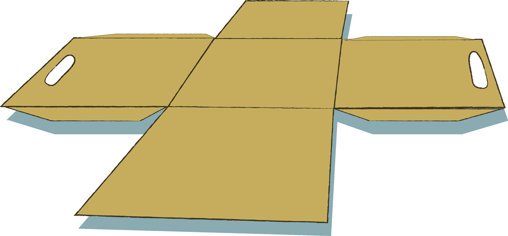
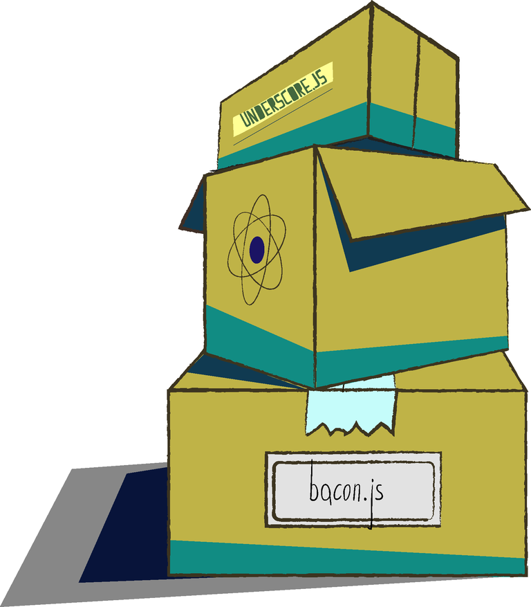

author:
  name: Джон, просто Джон
  github: sudodoki
  twitter: sudodoki
theme: sudodoki/reveal-cleaver-theme
output: index.html

--

<style type="text/css">
  .reveal pre code {
    font-size: 1.3em;
    line-height: 1.3em;
  }
  .no-uppercase a {
    text-transform: none;
  }
  .plain-image img {
    background: transparent!important;
    border: none!important;
  }
  .half {
    width: 50%;
    float: left;
  }
  .plain-image img {
    background: transparent!important;
    border: none!important;
  }
  .sticker-image {
    text-align: center;
  }
  .sticker-image img {
    height: 170px;
  }
</style>

```javascript
function OhHai() {
  console.log('just checking code size')
}

```


--
### Power of modules: tie that stuff together
<div class="no-uppercase">

<h2>[git.io/vaj9h](https://git.io/vaj9h)</h2>
<h2>[@sudodoki](http://twitter.com/sudodoki)</h2>
<h2>[#kpijs](https://www.facebook.com/kpijs)</h2>
</div>


--

# Who I am
These are the stickers I am associated with
<div class='plain-image sticker-image'>


</div>
--

# What this talk is about
+ Modules!
+ Huh? How do I load the module?
+ Nah, just put it all in big pile
+ Where do modules live?
+ Pack the web
+ Beyond simple bundling
+ Hey, what was that?

--

# Modules!
## Not the `|x|`


--

# Module vs Library vs Package

--

# Ancient times


--

# We don't need no stinking modules.
## What could possibly go wrong?
```javascript
var domEl = document.getElementById('app')
domEl.addEventListener('click', globalHandler)
globalBusinessLogicInit()
```
--

<h1></h1>

--

# Let's be smarter
## Closures
## Namespacing modules
```javascript
(function () {
  window.App = App || {};
  App.MyModule = App.MyModule || {};
})()
```

--


--

# AMD
## Not the one manufacturing hardware


--

# Asynchronous module definition
## born out of Dojo's experience using XHR+eval
[Bow to Dojo & YUI goes here]

--

# Two words
## `require`d
## to
## `define`

--

# Define: define
```javascript
define(
    module_id /*optional*/,
    [dependencies] /*optional*/,
    definition function
    /*function for instantiating the module or object*/
);
```

--

# Require
```javascript
require([
  module_id, /* optional */
  module_id2, /* optional */
  module_id3, /* optional */
])
```

--

# CommonJS
## 2009


--

# There's
## `module.exports`
# that you
## `require`

--

```javascript
// module1.js
module.exports = () => 'Not Yet Implemented, sry'
// module2.js
const businessLogic = require('./module1.js')
```

--

# Node.js flavor
~ `node_modules` you know

--

# ES6/2015
## 2013


--

# Module net exports
## Difference between
## `import`
## and
## `export`

--

```javascript
// module1.es.js
export default function businessLogic() {}
export function namedFunction() {}
// module2.es.js
import Module1BusinessLogic from './module1.es';
import {namedFunction} from './module1.es';
```

--

# Welp, modules are okay, how do I use one?
## module loaders
## module bundlers

--

# Loaders


--

# AMD
+ ## [**Require.js**](https://github.com/requirejs/requirejs)
+ ## [curl.js](https://github.com/cujojs/curl)
+ ## [Dojo](https://dojotoolkit.org/)
--

# Require.js Other nice things ©:
- anonymous modules
- configurable baseUrl, aliases
- plugins (`text!`, `css!`, [`whatever!`](https://github.com/jrburke/requirejs/wiki/Plugins))
- commonjs style

--

# CommonJS
+ ## [PINF](https://github.com/pinf/pinf-loader-js)
+ ## [require1k](https://github.com/Stuk/require1k)
~ Not too widespread

--

# New module syntax
## Standard feature w/o implementation?
# 🙀

--

# Polyfills
## [es6-module-loader](https://github.com/ModuleLoader/es6-module-loader)

--

# Loaders Pros
+ ### Dynamic loading (duh!)
+ ### No build step
+ ### Granular cache
+ ### One file erroring shouldn't break app
+ ### Better suited for HTTP/2 (?)

--

# Loaders Cons
+ ### Speed limitations (HTTP1?)
+ ### Occasional complexity

--

# Bundlers
~ some of those can be used with  
more than one type of module

--

# AMD
+ ## r.js (part of require.js)
  ~ almond.js
+ ## gulp-amd-bundler?

--


--

# CommonJS
+ ## [Browserify](http://browserify.org/)
+ ## [Webpack](https://webpack.github.io/)
+ ## [pure-cjs](https://github.com/RReverser/pure-cjs)

--

# Browserify


--


## First (?) to popularize
+ ### polyfill default node things and bundle modules for browsers
+ ### add transforms

--

# ES6
+ ## [Rollup.js](http://rollupjs.org/)

--

# Bundlers Pros
+ ### Single of few entry points
+ ### Best solution for spped

--

# Bundlers Cons
+ ### Build step required
+ ### Some restrictions (dynamic name for modules to be loaded, etc)

--

## Package Managers


--

+ ## [NPM](https://www.npmjs.com/)
+ ## [Bower](http://bower.io/)
+ ## [JSPM](http://jspm.io/)
+ ## [Duo](http://duojs.org/)
+ #### ender | [component](https://github.com/componentjs/component) | jam | spm

--

# Webpack


--

## Salesperson standpoint:
+ ### Code Splitting / Bundling
+ ### Optimizations
+ ### Pluggable loaders and plugins
+ ### Perfomance
+ ### Bundling for web/node/webworkers
+ ### DevTools and module API

--

## Module API enabling hot reload


--

# Loaders
Similar to 'tasks' in build tools
```
import React from 'react';
import './some-styles.scss';
import {alien_functions} from 'alien.coffee';
```

--

# plugins
Hook into compilation lifecycle
```javascript
function CustomNotification(options) {}

CustomNotification.prototype.apply = function(compiler) {
  compiler.plugin("done", () => {
    console.log("\n--- Done compiling! ---\n");
  });
};

module.exports = CustomNotification;
```

--

```javascript
new webpack.ProvidePlugin({
  'Promise': 'exports?global.Promise!es6-promise',
  'fetch': 'exports?self.fetch!whatwg-fetch'
}),
new webpack.optimize.OccurrenceOrderPlugin(),
new webpack.optimize.DedupePlugin(),
new ExtractTextPlugin('[name].[contenthash].css'),
```

--

# [Demo time](webpack-demo)


--

# QA?
<div class="no-uppercase">
<h2>[git.io/vaj9h](https://git.io/vaj9h)</h2>
</div>

--

## To Read
+ ### [Article of 2010 of when to use script loaders](https://msdn.microsoft.com/en-us/magazine/hh227261)
+ ### [Frontend Packagers](https://github.com/wilmoore/frontend-packagers)
+ ### [Browserify for webpack users](https://gist.github.com/substack/68f8d502be42d5cd4942)
+ ### [Webpack: list of tutorials](https://github.com/webpack/docs/wiki/list-of-tutorials)
+ ### [Webpack: some black magic MoscowJS](http://lgordey.github.io/)
+ ### [Webpack howto](https://github.com/petehunt/webpack-howto)

--

## Additional reading
+ ### [gtor](https://github.com/kriskowal/gtor)
+ ### [2ality on modules ](http://www.2ality.com/2014/09/es6-modules-final.html)
+ ### [Osmani on JS Patterns](addyosmani.com/resources/essentialjsdesignpatterns/book/)
