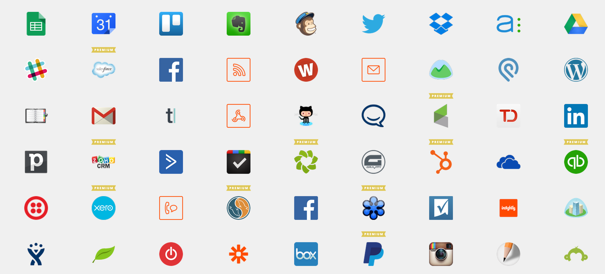

title: kyiv-js-june-15
output: index.html
theme: sudodoki/reveal-cleaver-theme
author:
  name: Джон, просто Джон
  twitter: sudodoki

--

# Love thou business
## [http://git.io/vIsuh](http://git.io/vIsuh)

--

# Validate ideas quickly & cheap

--

## Don't try selling your favourite framework for every task

--

# Static site generators
## [gh-pages](https://pages.github.com/) + [jekyll](jekyllrb.com)/[octopress](http://octopress.org/)

--

# Prototypes

--

# [Bootstrap](http://getbootstrap.com)/[Foundation](foundation.zurb.com)

--

# [Macaw](http://macaw.co) & others

--

# UX
## [proto.io](proto.io)

--

# [Zapier](https://zapier.com/)
## 400+ apps

--

# 

--

# Non-switching context

--

# Browser

--

# [Node](https://nodejs.org/)

--

# [BAAS](http://nobackend.org/)

--

# [Meteor](https://www.meteor.com/)/[Couchdb](http://guide.couchdb.org/draft/standalone.html)

--

# [Ionic](http://ionicframework.com/)/[Cordova](https://cordova.apache.org/)

--

# Push back
+ do not let prototype grow to production code
+ use another/cryptic language

--

# [Cleaver](https://github.com/jdan/cleaver)

--

# Hackathons
## wink-wink

