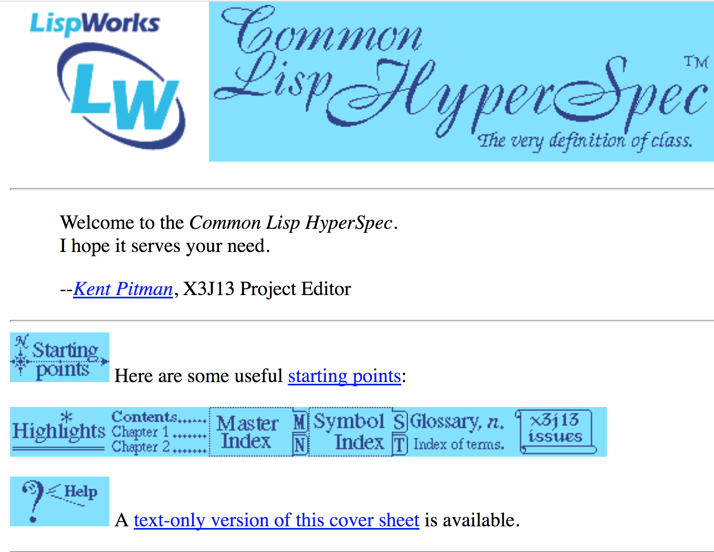
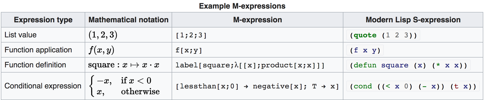
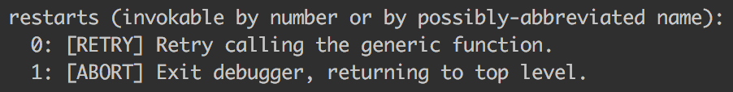

title: LISP ⚡️
author:
  name: sudodoki
  github: sudodoki
  twitter: sudodoki
theme: sudodoki/reveal-cleaver-theme
output: index.html

-- 


<style>
.reveal code {
  // font-family: "Joystix";
  font-size: 35px;
  line-height: 38px;
}
.reveal h1 code,
.reveal h2 code,
.reveal h3 code,
.reveal h4 code,
.reveal h5 code {
  font-size: inherit;
  line-height: inherit;
}
</style>
--

# Common Lisp:
# 10 things I didn't know about

--

## Language Spec

--

#  HYPERSPEC!! 



--

## S-epxressions

```lisp
(console.log
  "something"
  "something")
(*
  (+ 2 2)
  (+ 3 3))
```

--

> was neither finalized nor explicitly abandoned



--

## LISP is case insensitive

```lisp
(PrInT "passive-aggressive
  code formatting")
```

--

## Lots of implementations
>**CLISP** **SBCL** ABCL* LISPWORKS MACLISP
> CMUCL ECL CCL MKCL

`*` ABCL -> JVM

--

## [`#+`](http://www.lispworks.com/documentation/HyperSpec/Body/02_dhq.htm) / [`#-`](http://www.lispworks.com/documentation/HyperSpec/Body/02_dhr.htm)

--

### Restarts & conditions / Debugger


--

# CLOS
## generics / defmethods
## :pre :post :around methods

--

# Algol style `for` syntax
```lisp
(loop
  for line = (read-line file nil :eof)
  until (eq line :eof)
  do (format result "~A~%" line))
```
--

# Quicklisp

--

# You'll never know if someone is using CL
+ Lisp Chief Software Architect - $100K - Kiev, UA
+ Marijn Haverbeke

--

# Lisp Curse

-- 

# Resources
+ http://l1sp.org
+ https://leanpub.com/lisphackers/read
+ http://gigamonkeys.com/book/
+ http://articulate-lisp.com/
