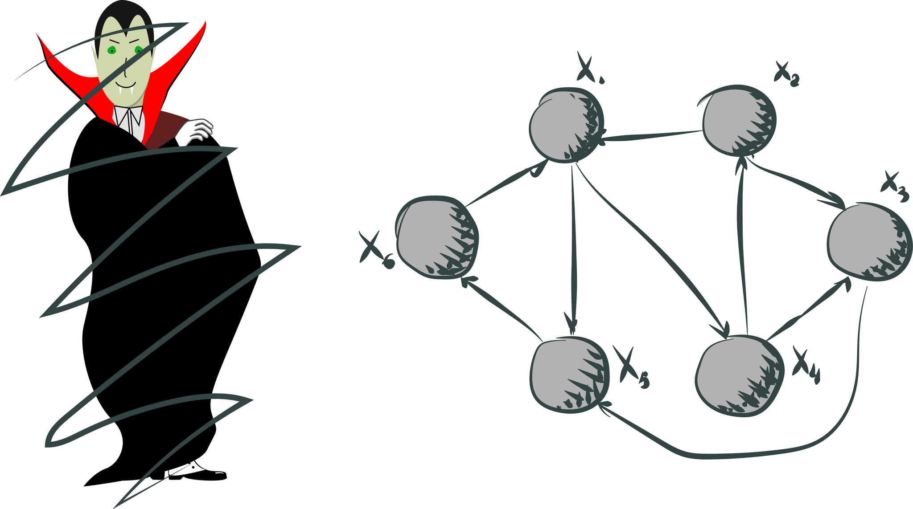
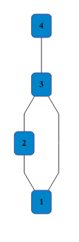
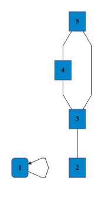
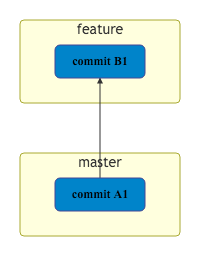
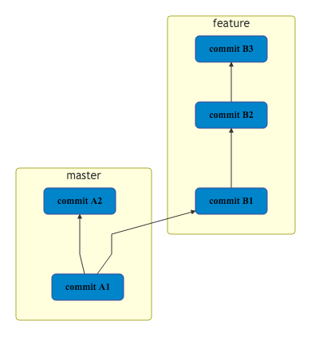
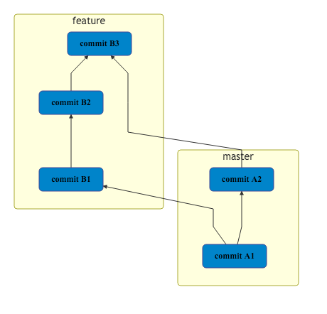
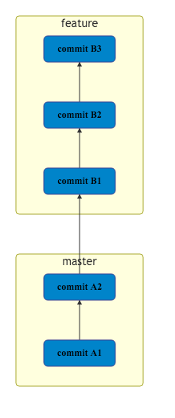
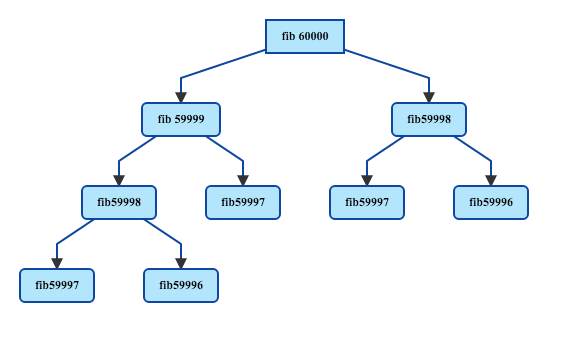
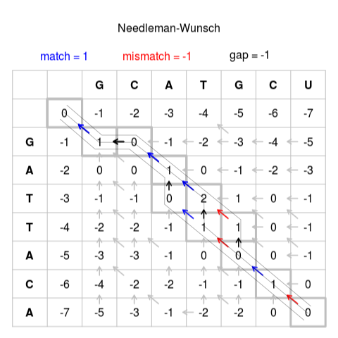
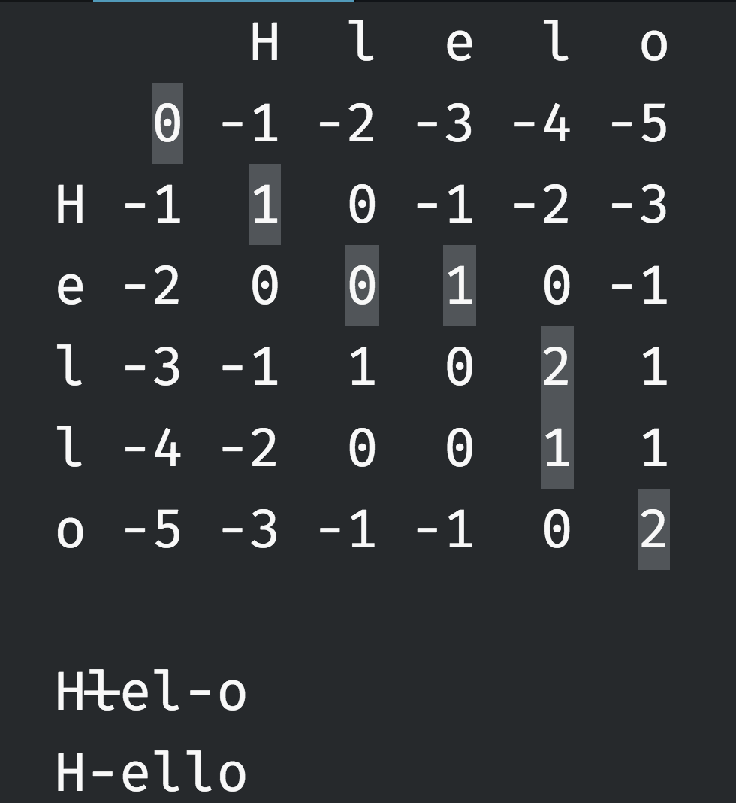

title: Beauty of Everyday Tools
author:
  name: |
    John
    aka Alex Lapshyn
  email: smd.deluzion@gmail.com
  github: sudodoki
  twitter: sudodoki
theme: reveal-cleaver-theme
output: index.html

--

### Beauty of everyday tools (gif by [@inconvergent](https://twitter.com/inconvergent))


--

<style>
h1.name { white-space: pre }
.no-uppercase a { text-transform: none; }
.plain-image img {
  background: transparent!important;
  border: none!important;
}
.half {
  width: 50%;
  float: left;
}
</style>

### Typical web-apps.


--

## about:~~blank~~ me
+ Team Lead at R⚡️R (Rails Reactor)
+ KyivJS
+ Nodeschool Kyiv
+ Kottans.org

--

### Shameless plug
<div class="half">
  
  <h3>Become a speaker at <a href="http://kyivjs.org.ua/#write-anchor">KyivJS</a></h3>
</div>
<div class="half plain-image">
  
  <h3>Organize event or search for comrade at <a href="https://github.com/Kottans/kottans-ongoing-projects/issues">github/kottans-ongoing-projects</a></h3>
</div>

--

# Disclaimer
+ web products (usually) solve customer needs => they are absolutely useful
+ people can genuinely be passionate about styling, conversion rates, creating beautiful landings, etc.

--

### Web development in a nutshell
[](https://www.facebook.com/skovalyov/posts/10154416670394772?pnref=story)

--

### Algorithms in our everyday works
[](https://twitter.com/mikhailbortnyk/status/729956639831412736)

--

## Possible Reasons (?)

+ No CS background - most of us being self-taught
+ Domain of tasks we are solving
+ JS being high level language
+ Culture of reusing existing solutions / packages, w/o going into details

--

## But, John, why would we need algorithms?

<div class="fragment">
  <h3>That might solve your programming problems</h3>
</div>
<div class="fragment">
  <h3>That might solve your everyday chores</h3>
</div>

--

## Programming Problems
### If you are not aware of standard CS problems, you won't recognize one, when you see it

--

## Everyday chores
### Looking for bad commit that broke some feature


```
👇
① ② ③ ④ ⑤ ⑥ ⑦ ⑧ ⑨ ⑩
                💣        
           👇
① ② ③ ④ ⑤ ⑥ ⑦ ⑧ ⑨ ⑩
                💣  
```
--

```
❌ 👇
① ② ③ ④ ⑤ ⑥ ⑦ ⑧ ⑨ ⑩
                💣        
❌ ❌ ❌ ❌ ❌      👇
① ② ③ ④ ⑤ ⑥ ⑦ ⑧ ⑨ ⑩
                💣  
```
--

```
❌ ❌ 👇
① ② ③ ④ ⑤ ⑥ ⑦ ⑧ ⑨ ⑩
                💣        
❌ ❌ ❌ ❌ ❌ ❌ 👇 ✅ ✅ ✅
① ② ③ ④ ⑤ ⑥ ⑦ ⑧ ⑨ ⑩
                💣  
```

--

# That's binary search
## and `git bisect` in action

--

# Git
+ VCS / <abbr title="Source control management">SCM</abbr> created by Linux core developers coming from frustrations of using tools of that time
+ Based on snapshot of trees (not diffs)

--

# Highlevel

>GIT is operating on DAG of commits that are tree representation of filesystem using SHA hashing for addressing almost everything

--

### DAG – directed acyclic Graph


--

## Set of vertices and edges. Applications
+ computer networks
+ social networks
+ roads
+ electric circuits
+ dependency graph
+ FSM

--

## Direction
<div class="half">
  <h2>Directed</h2>
  
</div>
<div class="half no-border">
  <h2>Undirected</h2>
  
</div>
--

## Cycles



--

# Algorithms/problems on Graphs

+ Shortest path (weighted/unweighted)
+ Minimum spanning tree
+ Maximum flow problem

--

`git log --graph --oneline --decorate`


--


--

--

## Converging branches: Merge


--

## Converging branches: Rebase


--

## A bit about how git stores it's data
### Should make it less abstract

--

## Main items in any `.git`
+ HEAD
+ config
+ description
+ hooks/
+ info/
+ objects/
+ refs/

--
## File tree snapshot storing is based on storing
+ ## Blobs
+ ## Trees
+ ## Commits
### Where do they actually go?
--
```
├── objects
│   ├── 00
│   │   ├── 431bc7c5ed0017b1fca52f1122980774a146a9
│   │   └── …
│   ├── 01
│   ├── 02
│   ├── …
│   ├── fd
│   ├── fe
│   ├── ff
│   ├── info
│   └── pack
```
<p style='white-space: pre'>2 chars folder + 38 chars filename
= 40 hex digits product of hashing</p>
--

## Hash functions


--

## Mapping data of arbitrary size to fixed size

--

# Main usages

+ backing up hash data structures
+ caching
+ cryptographic
+ finding similar / duplicated data items

--

# [SHA-1](https://en.wikipedia.org/wiki/SHA-1)
+ Cryptographic hash function
+ 20 bytes hash value (aka message digest)
+ 512 bits block
+ Doing And, Xor, Rot, Add (mod 2^32), Or 80 times
### Provides not security, but integrity

--

## Further reading
+ Consistent hashing
+ Perfect hash function

--

# zlib
## Is used to compress content in .git
### Using [DEFLATE](https://en.wikipedia.org/wiki/DEFLATE) algo (which is Huffman + LZ77)

--

## So, back to storage. We have
+ ## Blobs
+ ## Trees
+ ## Commits

--
## Viewing object (since everything's compressed)
```
git cat-file -p aa823728ea7d592acc69b36875a482cdf3fd5c8d
```
--

# Blobs
```
$ echo sweet > YOUR_FILENAME
$ git init
$ git add .
$ find .git/objects -type f
```
.git/objects/aa/823728ea7d592acc69b36875a482cdf3fd5c8d.

```
"blob" SP "6" NUL "sweet" LF
```
where SP is a space, NUL is a zero byte and LF is a linefeed.
--
# Trees
```
100644 blob 4687bc4f4462088a00aaff176e3cfd311a4f9e04   	.babelrc
100644 blob fa8a4aacfa716aafd9ded87567fcfa4bed5e4061   	.csscomb.json
100644 blob e717f5eb6387be229227ad8eba6a56f4cd904ade   	.editorconfig
100644 blob e9f486a694fece6be49c05422579c20f895b83e4   	.env
040000 tree d327d6e018c025ba8932fa816bd5ace0221694bb   	bin
```
A list of tuples consisting of a mode, type, a hash and a filename
--
# Commits
```
tree 5f21948d725eb30db0a79ef9666145d86d960a1c
parent 996b318d339c002fd3bcb38a0a149879b9c1c3af
parent 93c169a6a9c79b6e7282735eb2e2187421c73796
author Джон, просто Джон <smd.deluzion@gmail.com> 1472120347 +0300
committer GitHub <noreply@github.com> 1472120347 +0300

Merge pull request #1 from sudodoki/merge-commit-demo

This is a commit to display commit with multiple items
```

--

# Notes on storing
+ If your project is very large and contains many unrelated files that are constantly being changed, Git may be disadvantaged more than other systems because single files are not tracked. Git tracks changes to the whole project, which is usually beneficial.

--

>It looks like you could mix together a few shell scripts and add a dash of C code to cook it up in a matter of hours: a melange of basic filesystem operations and SHA1 hashing, garnished with lock files and fsyncs for robustness. In fact, this accurately describes the earliest versions of Git. Nonetheless, apart from ingenious packing tricks to save space, and ingenious indexing tricks to save time, we now know how Git deftly changes a filesystem into a database perfect for version control.

--

## [Raccit](https://github.com/sudodoki/raccit)


--

## Trees – types of graphs


--

## a root node with value and subtrees of children, represented as a set of linked nodes

--

# Usages
+ DOM
+ AST
+ File systems
+ DB: indexes
+ LDAP
+ Sorting
+ Geometry/graphics

--

# Representations
+ Hash
+ List
+ Array / master table


--

# Hashes
```
{
  data: 'root',
  children: [
    {
      data: 'A',
      children: [
        {data: 'B'},
        {data: 'C'}
      ]
    },
    {data: 'B'}
  ]
}```

--

# List
```
['root',
  ['A',
    ['C', 'D']],
  ['B']
]
```

--

# Array (given we know branching factor)
```
['root', 'A', 'B', 'C', 'D']
```

--

# Main tasks
+ Traversal
+ Sorting
+ Keeping constrains / balancing trees

--

# Traversal
+ DFS
+ BFS

--

# DFS


--

```javascript
var tree = ['root', ['A', ['C', 'D']], ['B']]
function dfs([el, ...children], fn) {
  fn(el);
  children.forEach((node) => dfs(node, fn));
}
dfs(tree, console.log.bind(console)); /* root A C D B */
```
--

```javascript
var tree = ['root', 'A', 'B', 'C', 'D'];

const hleft = (i) => (i + 1) * 2 - 1
const hright = (i) => (i + 1) * 2

function _dfs(tree, el, fn) {
  if (!tree[el]) { return null; }
  fn(tree[el])
  if (hleft(el) < tree.length) {
    _dfs(tree, hleft(el), fn)
    _dfs(tree, hright(el), fn)
  }
}
function dfs(tree, fn) {
  _dfs(tree, 0, fn)
}
dfs(tree, console.log.bind(console)); /* root A C D B */

```
--

# BFS

--
```javascript
var tree = ['root', ['A', ['C', 'D']], ['B']]

function bfs(tree, fn) {
  var queue = [];
  queue.push(tree);
  next = queue.shift();
  while (next) {
    const [data, ...children] = next;
    fn(data);
    queue = queue.concat(children);
    next = queue.shift();
  }
}

bfs(tree, console.log.bind(console)); /* root A B C D */
```
--
```javascript
var tree = ['root', 'A', 'B', 'C', 'D'];
function bfs(tree, fn) {
  tree.filter(i=>i).map((el) => fn(el));
}
bfs(tree, console.log.bind(console)); /* root A B C D */

```

--

# Let's talk about diffing
## Sequence alignment

--

## Solved by Dynamic Programming


--

## Basically, programming by filling out tables

--

```javascript
const fib = (n) =>
  n <= 1 ?
    1
    : fib(n - 1) + fib(n - 2)
```
--

## fib(60000)
>VM111:1 Uncaught RangeError: Maximum call stack size exceeded(…)
--

## Why is that?
<div class='fragment'>
  
</div>
--
```javascript
const answers = [1, 1]
const fib = (n) => {
  if (!answers[n]) {
    for (let i = 2; i <= n; i++) {
      answers[i] = answers[i - 1] + answers[i - 2];
    }
  }
  return answers[n];
}
```
--

## It works <div class='fragment'>really fast.</div>
<div class="fragment">
<h3>Answer is <code>Infinity</code></h3>
</div>
--

## Basic algorithm to develop dynamic programming algorithms
+ Identify subtask
+ Fill the base case
+ Find recurrent rule for climbing up subtasks
+ Fill out the table
+ Backtracking path / etc.

--

# Needleman–Wunsch
```javascript
result[y][x] = Math.max(
  result[y - 1][x] + costMatrix.INSERTION(),
  result[y][x - 1] + costMatrix.DELETION(),
  result[y - 1][x - 1] +
    costMatrix.CHANGE(firstWord[x - 1], secondWord[y - 1])
);
```
--

--

--

## So, if you were to learn git internals, you would learn about:
+ Hashing
+ Compression
+ DAG
+ Trees
+ Dynamic programming

and there's so much more (heuristics to detect file rename, ref-packs, etc)…

--

## Let's stop other devs looking down on JS devs

+ Learn new paradigms
+ Learn algorithms
+ Learn design patterns

--

## TL;DR: Learn core principles, not just (hype) technologies

--

## Have you ever looked at how following things were implemented:
+ base64
+ GZIP
+ react dom diffing
+ d3 packing layouts

--

## To read
+ [Git. Origin: the mailing thread](https://lkml.org/lkml/2005/4/6/121)
+ [Git from the bottom up](https://jwiegley.github.io/git-from-the-bottom-up/)
+ [Git magic](http://www-cs-students.stanford.edu/~blynn/gitmagic/ch08.html)
+ [Projector's Algorithms course](https://github.com/vseloved/prj-algo/tree/master/lecs)

Images by [@ShakedBrains](timmpa@gmail.com )
