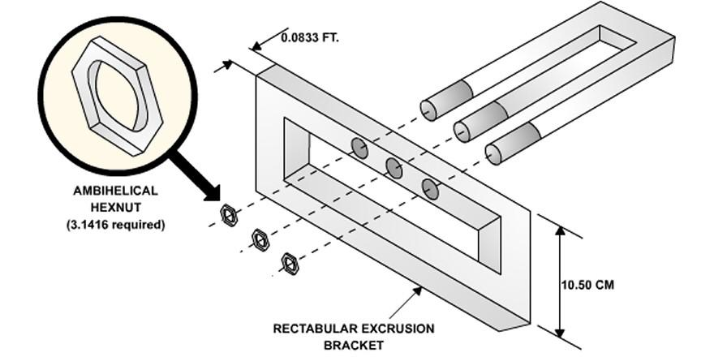
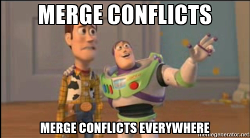

title: Pivorak 2020 Лакмусові папірці вашого проекту
author:
  name: Джон, просто Джон
  github: sudodoki
  twitter: sudodoki
theme: sudodoki/reveal-cleaver-theme-bright
output: index.html

--

<style type="text/css">
  .no-uppercase a {
    text-transform: none;
  }
  .plain-image img {
    background: transparent! important;
    border: none !important;
  }
  .scale-img img {
    max-height: 250px;
    min-height: 250px;
  }
  .half {
    width: 50%;
    float: left;
  }
  .semi-header strong {
    font-size: 130% !important;
  }
</style>

### Лакмусові папірці вашого проекту
<div class="no-uppercase">
<h2>[https://git.io/JvwB6](https://git.io/JvwB6)</h2>
<h2>[@sudodoki](http://twitter.com/sudodoki)</h2>
</div>


--

### aka вічне сяйво палаючої сраки
<iframe src="https://giphy.com/embed/70vRErHAocQuc" width="480" height="270" frameBorder="0" class="giphy-embed" allowFullScreen></iframe><p><a href="https://giphy.com/gifs/jim-carrey-gif-the-eternal-sunshine-of-spotless-mind-70vRErHAocQuc">via GIPHY</a></p>

--

<div class="plain-image">

<div>
- **ML lead**
- **web dev experience**

--

# Частина I.
## Про біль

- що таке біль?
<li class="fragment">
чи нормально відчувати біль при роботі?
</li>
<li class="fragment">
що робити, якщо відчуваєте біль?
</li>

--

# Відповідь:
## Рефлексія + Терапія 🔜 дії
> якщо ви працюєте водієм, це ж нормально робити техогляд вашого транспортного засобу?
--

# Трішки майже типових проблем

--

# 🤕Ніхто не любить код рев'ю
<div class="fragment">
<iframe src="https://giphy.com/embed/J5pL0tcZ4YPqBkafus" width="480" height="270" frameBorder="0" class="giphy-embed" allowFullScreen></iframe><p><a href="https://giphy.com/gifs/memecandy-J5pL0tcZ4YPqBkafus">via GIPHY</a></p>
</div>
--

# Від чого болить
- 👎 чіпляються до форматування і лапок
<li class="fragment">
👎 замість того, щоб валідувати бізнес-логіку
</li>
<li class="fragment">
👎 "це не так, як я хотів, перероби"
</li>

--

# Як краще?
- 👍 поради щодо зменшення складності / кращі підходи для вирішення задачі
<li class="fragment">
👍 якщо є більше одного способу, обговоріть +/- інших
</li>
<li class="fragment">
👍 якщо комусь незрозуміло, спробуйте спростити / задокументувати код
</li>
<li class="fragment">
💭 довіряйте колегам
</li>

--

### `*` щодо менш досвідчених розробників і "перероби"
## Вирішення краще проговорити до того, як код потрапить до рев'ю

--

## Перекладіть це на машину
## 🤖
- [editorconfig](https://editorconfig.org/)
- автоматичне форматування коду (rubocop / prettier / black), лінтери (rubocop / eslint / flake8 and [alternatives](https://github.com/wemake-services/wemake-python-styleguide))
- (юніт) тести на бізнес логіку
- аналізатор невживанного коду (IDE, [@joshuaclayton/unused](https://unused.codes/), [vulture](https://pypi.org/project/vulture/))
- детекція дубльованого коду ([@kuchrenko/jscpd](https://github.com/kucherenko/jscpd))

--

# Приклад editorconfig'а
```
# http://editorconfig.org
root = true

[*]
indent_style = space
indent_size = 2
end_of_line = lf
charset = utf-8
trim_trailing_whitespace = true
insert_final_newline = true

[*.{md,txt}]
trim_trailing_whitespace = false

[Makefile]
indent_style = tab
```

--

## 🤕Новій людині дуже важко запустити проект


--

# Як краще?
+ ✍️ документація (гарна нагода її покращити)
+ 🤖 зафіксувати залежності (не Ruby проблема😁)
+ 🤖 rake/make скрипти для зовнішніх залежностей
+ 🤖 контейнери/віртуалки
+ 🤖 наявність CI конфіга

--

## 🤕 У вас є папка, куди ви скидаєте увесь "зайвий" код


--

# Що змінити?
+ ✍️ радитися
+ ✍️ не боятися пропонувати нові способи організовувати код
+ ✍️ переглядати попередні рішення
+ ✍️ фіче орієнтовний підхід
+ ✍️ подивится на кращі практики з DDD / OOP 

--

## 🤕 Кожен реліз це біль
- із-за великої кількості мануальних операцій
- dev відрізняється від prod
- відбувається так рідко, що кожен раз дуже тяжко
- etc.

-- 

# Як краще?
+ 🤖 автоматизувати CI/CD
+ 🤖 infrastructure-as-a-code (terraform, [etc](https://github.com/topics/infrastructure-as-code))
+ ✍️ частіше релізитись
+ ✍️ додати pre-prod

--

## 🤕 Ніхто не любить мерджити код


--

- ✍️ [some git workflow](https://www.endpoint.com/blog/2014/05/02/git-workflows-that-work)


--

# Що змінити?
- ✍️ декомпозиція коду, [service objects](https://www.toptal.com/ruby-on-rails/rails-service-objects-tutorial) FTW
- ✍️ час подумати про мікросервіси?

--

## 🤕 Ніхто не знає, що відбувається з запущеним застосунком


--

# Як краще?
- 🤖 телеметрія (cloud built-in)
- 🤖 логування (elk / fluentd / fluentbit)
- 🤖 інші метрики ([prometheus](https://prometheus.io/) + [grafana](https://prometheus.io/docs/visualization/grafana/), [datadog](https://www.datadoghq.com/))

--

## 🤕 Про помилки вам розповідають клієнти/QA
<div class="fragment">
- 🤖 [трекінг помилок](https://stackshare.io/sentry/alternatives) 
</div>

--

## 🤕 Є місця в коді, куди ніхто "не хоче лізти"
<div class="fragment">
- ✍️ вчасно виплачуйте відсотки за своєю кредитною карткою технічного боргу
</div>
<div class="fragment">
- ✍️ підвищуйте обізнаність людей про різні частини кодової бази
<div class="fragment">
- ✍️ але хтось мусить мати чітке розуміння, як що працює
</div>

--

## 🤕 Тікет переведений у рев'ю, але нічого не працює і все "не так"
<div class="fragment">
- 🤖 контракти ([swagger](https://swagger.io/), [protobuf](https://developers.google.com/protocol-buffers), etc) для швидкої перевірки до інтеграції
</div>
<div class="fragment">
- 🤖 e2e тести
</div>
<div class="fragment">
- 🤖 окремі енви під фіче бранчі (🤔)
</div>
<div class="fragment">
- ☝️ нам платять не за переведення тікетів у джирі, а працюючий функціонал
</div>


--

## Та можливо багато і інших питань
- чи знаєте ви, над чим працюють інші у команді?
- якщо щось зламалося, чи всі знають як це сталося і як це вирішили?
- чи радяться люди з технічних і архітектурних питань?
- чи вивчили ви щось нове за останні 3 місяці на робочому місці?
- чи відчуваєте ви задоволення від роботи?

--

## не 100% проблем співпадуть з вашими кейсами, але сподіваюсь, напрям зрозумілий

--

# Частина ІІ. 
## Про зміни

--

## Вочевидь, 
# є 2 варіанти
- еволюція
- революція

--

#### Що робити, якщо не ви приймаєте "важливі технічні рішення"?

1. Заручіться підтримкою, в ідеалі, людини яка приймає "важливі технічні рішення"
<li class="fragment">
Почніть з малого (localhost / "підсадіть" інших членів команди)
</li>
<li class="fragment">
Якщо у вас є єдине рішення проблеми, воно стане де-факто стандартом (поки не з'явиться краще рішення)
</li>

--
4. "Продавайте" рішення бізнесу (використовуючи політичний капітал, презентації, працюючий POC, скорочення витрат, етс)
<li class="fragment">
Враховуйте фідбек членів команди (попередній негативний досвід с технологіями, etc)
</li>
--

### Ефективні, але не зовсім етичні способи
1. Відтінити варіанти, виставляючи потрібний вам у вигідному світлі
<li class="fragment">
Інвестувати власний час задля впровадження ідеї
</li>
<li class="fragment">
"Інакше технічний борг нас зжере"
</li>

--

# Підсумовуючи
- робота над софтом не мусить бути весь час болісною
- покращуйте стан речей, по кроку за раз
- ви – частина команди і разом ви зможете все (якщо захочете)

--

# Related (?)
- [Art of Scalability](https://www.amazon.com/Art-Scalability-Architecture-Organizations-Enterprise/dp/0134032802)
- [The Phoenix Project](https://www.amazon.com/gp/product/B078Y98RG8/)
- [100 releases per day @ Preply](https://www.youtube.com/watch?v=EuKvUS4oi1Q&feature=emb_title)
- [12 steps to better code](https://www.joelonsoftware.com/2000/08/09/the-joel-test-12-steps-to-better-code/) oldie, but should have most of the boxes checked in 2020
- [awesome linters ](https://github.com/caramelomartins/awesome-linters)

--

# Q&A?

<div class="no-uppercase">
<h2>[https://git.io/JvwB6](https://git.io/JvwB6)</h2>
<h2>[@sudodoki](http://twitter.com/sudodoki)</h2>
</div>