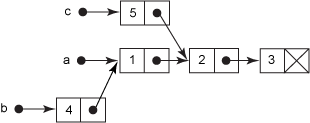
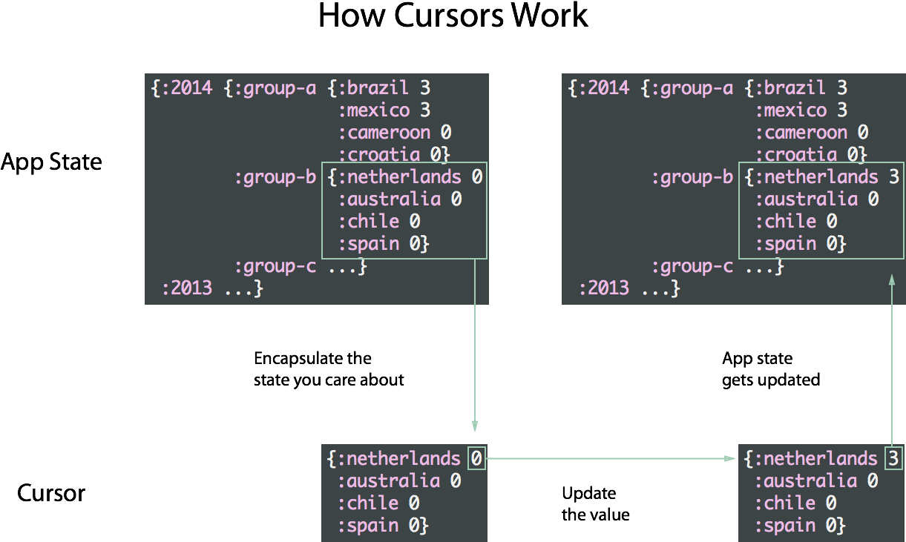

title: react-102-slides
author:
  name: sudodoki
  email: smd.deluzion@gmail.com
  twitter: sudodoki
output: index.html
<!-- theme: sudodoki/reveal-cleaver-theme -->

--

# React: components interaction

--

###Solutions:
1. No interaction
2. Callbacks
3. PubSub (EventEmitter/Backbone Model) | Global State
....
+ Flux | FRP streams | Tree

--

# No interaction
## Each component is either too big or too dumb

--

# Callbacks
## [Demo time!](../react-callbacks)

--

# PubSub
## Generic solution involving passing EventEmitters to component, subscribing & publishing stuff with no particular order

--

# Backbone Models

--

# Pros:
+ Migrating existing Backbone App
+ EventEmitters on Frontend
+ REST

--

# Cons:
+ Comparison (toJSON solution) 
+ `change` event is fired when value is changed (not on every change)
+ Mutable from everywhere

--

# [Flux](https://facebook.github.io/flux/) 
## Application architecture for building user interfaces, introduced in Spring 2014

--

# FB case - chat syncing issues

--

## Grand scheme of things


--

## Zoom X2


--

## Controller-View or Dumb-Smart components

--

## Rules of Flux (via [@dan_abramov](https://twitter.com/dan_abramov))


--

# [Flux && Flux-like options](https://gist.github.com/danawoodman/47f112bf4f1a114e9542)

--

# [Demo time!](../react-flux)

--

## [Dispatcher](https://facebook.github.io/flux/docs/dispatcher.html)


--

# Cursors & stuff

--

# Flashback: [Om](https://github.com/omcljs/om)

--

# Clojurescript
## yet more perfomant than JS. [Article](http://swannodette.github.io/2013/12/17/the-future-of-javascript-mvcs/)

--

# Immutability 
## [Persistent data structure](http://en.wikipedia.org/wiki/Persistent_data_structure)

--

```
(def a (list 1 2 3))
(def b (conj a 4))
(def c (conj (rest a) 5))
```
# [](images/cljs-lists.gif)

--

```
(def brown [0 1 2 3 4 5 6 7 8])
(def blue (assoc brown 5 'beef))
```
[](images/cljs-vectors.png)

--

# For JS
## [Immutable](http://facebook.github.io/immutable-js/) by FB
## [Mori](http://swannodette.github.io/mori/) from cljs

--



--

### Built on top of React, using concept from Om

+ [Omniscient](https://github.com/omniscientjs/omniscient)
+ [Moreartyjs](https://github.com/moreartyjs/moreartyjs)
+ [Baobab-React](https://github.com/Yomguithereal/baobab-react)

--

### So, main approaches
+ Single atom
+ Multiple atoms
+ (Fluxish & immutable models)

--

# [Demo time!](../react-cursors)

--

# FRP
## aka Functional Reactive Programming

--

## Functional + Reactive Programming

--

### What is 'Reactive'?
+ Excel cells/formulas
+ ```
var x = 1;
boundedvar y = x + 1;
x = 2;
console.log(y); // -> 3
```

--

### What is 'Functional'?
+ functional programming style
+ pure functions (side-effect free)

--

### Best fit?
+ handling user input
+ dealing with asynchronous operations

--

### Popular implementations in JS
+ [RxJS](https://github.com/Reactive-Extensions/RxJS)
+ [Bacon.js](https://baconjs.github.io/)
+ [kefir](http://github.com/rpominov/kefir)

--

# Main abstractions
+ Stream/Observable
+ Bus/Subject?
+ Property
<style>
  table { width: 100%; min-height: 350px;}
</style>

--

             | **Singular**         | **Plural**
:----------: | :------------------: | :---------------------:
**Spatial**  | Value                | Iterable&lt;Value&gt;
**Temporal** | Promise&lt;Value&gt; | Observable&lt;Value&gt;

--

##  Bacon.js
## 

--

<style>
.quote {
  display: block;
  margin: 0 auto;
}
.quote p {
  font-size: 40px;
  font-weight: 500;
  font-style: italic;
}
</style>
<blockquote class="quote">
  <p>
    «Turns your event spaghetti into clean and declarative feng shui bacon»
  </p>
</blockquote>

--

# Bus
PubSub message queue.
Can
+ `plug` streams
+ `push` events manually
+ listen `onValue`

--

# Property
Superbound variable, snapshot of the stream
Created using:
+ scan() - just like reduce on collection
+ toProperty() - just expose as supervariable/bound variable

--

# Some of the [API](https://baconjs.github.io/api.html)
+ map
+ mergeAll
+ flatMap
+ flatMapLatest
+ skipDuplicates

--

```
Not Only People stream
========🐼=😍===😍==🐷==>
CatifyPeople = (⍰) => ⍰ === 😍 ? 😻 : ⍰
(Not Only People stream).map(CatifyPeople)
========🐼=😻===😻==🐷==>
```

--

# ~~Demo time!~~ The way it could have gone

--

```
total = this.state.counters.map(function (obs) {
  // obs.map(() => 1);
  return obs.map(1);
}).reduce(function (memo, obs) {
  if (!memo) {
    return obs;
  }
  return memo.merge(obs)
}).scan(0, function (counter, toAdd) { return counter + toAdd})
```

--

### To Read/Watch:

+ [Flux introduction video](https://www.youtube.com/watch?list=PLb0IAmt7-GS188xDYE-u1ShQmFFGbrk0v&t=621&v=nYkdrAPrdcw)
+ [The Case for Flux](https://medium.com/@dan_abramov/the-case-for-flux-379b7d1982c6)
+ [Good bye Flux, welcome Bacon/Rx?](https://medium.com/@milankinen/good-bye-flux-welcome-bacon-rx-23c71abfb1a7)
+ [Building Angular Apps using Flux Architecture](http://victorsavkin.com/post/99998937651/building-angular-apps-using-flux-architecture)
+ [Handling States in Your ReactJS FLUX Application with Baobab](https://www.codementor.io/reactjs/tutorial/flux-reactjs-state-baobab-library)
+ [Handling complex state with Baobab](https://github.com/christianalfoni/EmptyBox/blob/master/posts/2015_04_26_Handling-complex-state-with-Baobab.md)
+ [The introduction to Reactive Programming you've been missing](https://gist.github.com/staltz/868e7e9bc2a7b8c1f754)
+ [Bacon.js Cheatsheet](http://www.cheatography.com/proloser/cheat-sheets/bacon-js/)
+ ...

--
+ [React-Bacon ToDoMVC](https://github.com/milankinen/react-bacon-todomvc)
+ [Функциональное программирование в браузере](http://tonsky.me/talks/2015-codefest/)
+ [David Nolen - Immutability, interactivity & JavaScript (FutureJS 2014)](https://www.youtube.com/watch?v=mS264h8KGwk)
+ [f-react-kit](https://github.com/roman01la/f-react-kit)
+ [transit-js](https://github.com/cognitect/transit-js)

