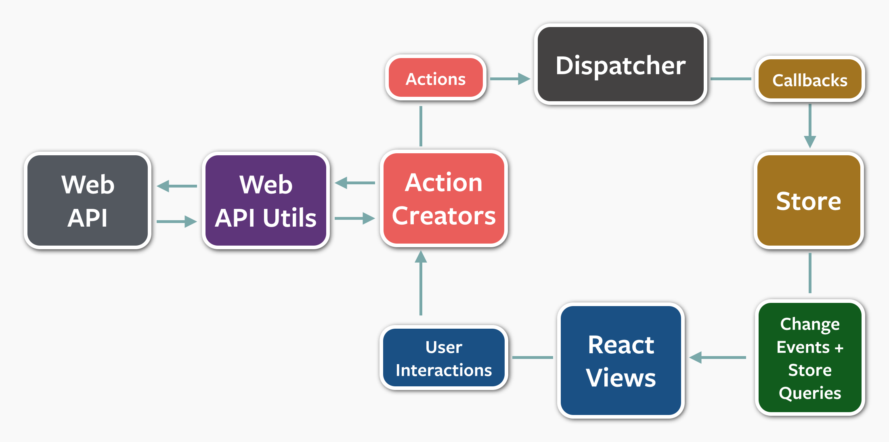
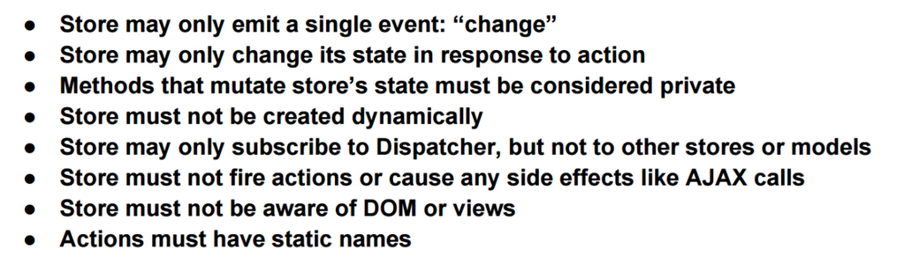
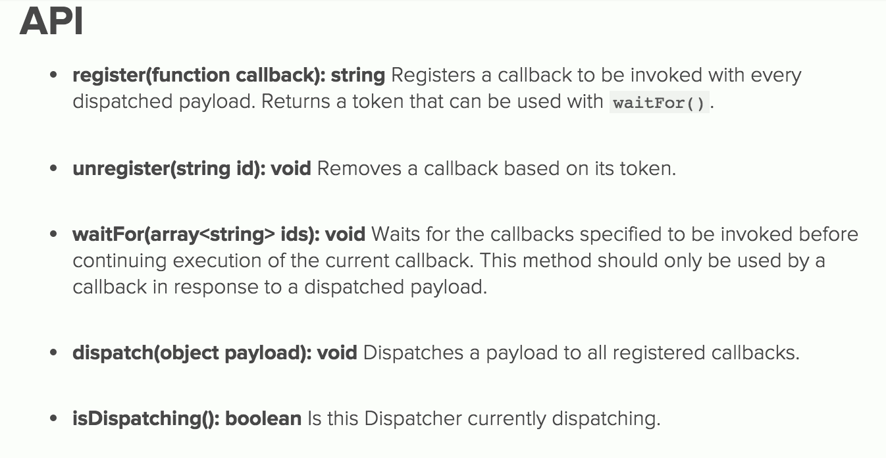

title: react-102-slides
author:
  name: sudodoki
  email: smd.deluzion@gmail.com
  twitter: sudodoki
output: index.html
<!-- theme: sudodoki/reveal-cleaver-theme -->

--

# React: components interaction

--

Solutions:
1. No interaction
2. Callbacks
3. PubSub (EventEmitter/Backbone Model) | Global State
....
+ Flux | FRP streams | Tree

--

# No interaction
## Each component is either too big or too dumb

--

# Callbacks
## [Demo time!](../react-callbacks)

--

# PubSub
## Generic solution involving passing EventEmitters to component, subscribing & publishing stuff with no particular order

--

# Backbone Models

--

# Pros:
+ Migrating existing Backbone App
+ EventEmitters on Frontend
+ REST

--

# Cons:
+ Comparison (toJSON solution) 
+ `change` event is fired when value is changed (not on every change)
+ Mutable from everywhere

--

# [Flux](https://facebook.github.io/flux/) 
## Application architecture for building user interfaces, introduced in Spring 2014

--

# FB case - chat syncing issues

--

## Grand scheme of things

--

## Zoom X2

--

## Controller-View or Dumb-Smart components

--

## Rules of Flux (via [@dan_abramov](https://twitter.com/dan_abramov))

--

# [Flux && Flux-like options](https://gist.github.com/danawoodman/47f112bf4f1a114e9542)

--

# [Demo time!](../react-flux)

--

## [Dispatcher](https://facebook.github.io/flux/docs/dispatcher.html)

--

### To Read/Watch:

+ [Flux introduction video](https://www.youtube.com/watch?list=PLb0IAmt7-GS188xDYE-u1ShQmFFGbrk0v&t=621&v=nYkdrAPrdcw)
+ [The Case for Flux](https://medium.com/@dan_abramov/the-case-for-flux-379b7d1982c6)
+ [Good bye Flux, welcome Bacon/Rx?](https://medium.com/@milankinen/good-bye-flux-welcome-bacon-rx-23c71abfb1a7)
+ [Building Angular Apps using Flux Architecture](http://victorsavkin.com/post/99998937651/building-angular-apps-using-flux-architecture)
