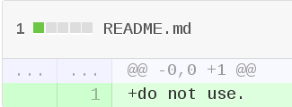
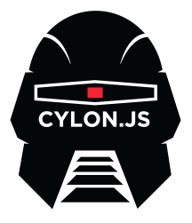

title: robo-meetup-first
author:
  name: sudodoki
  email: smd.deluzion@gmail.com
  twitter: sudodoki
output: index.html

--

# O HAI!

--

Я буду говорить о:
  + node-serialport
  + NodeBots
  + Всякие разные штуки, в основном, для жс
  + Разные стартер-киты ардуин

--

# Chris Williams ([@voodootikigod](https://github.com/voodootikigod))
## Организатор JSConf
## [node-serialport](https://github.com/voodootikigod/node-serialport)
## Логотип JS

--

# node-serialport
## Первый коммит: 7 Sep 2010
## 
##Package to access serial ports for reading and writing
--

Его же слова:
>I prefer to use node.js for programming arduinos, wireless stacks, printers, toasters, etc. (anything through the serial port), for some very definitive reasons the most direct reason is simplicity.

Просто + недалеко от натива.

--

# Bonus: [browser-serialport](https://github.com/garrows/browser-serialport)*

*works only for Chrome Packaged App =(
--

### Sidestep: [Firmata](http://www.firmata.org/wiki/Main_Page)
Firmata is a generic protocol for communicating with microcontrollers from software on a host computer. It is intended to work with any host computer software package.  
Included in Arduino since version 0012.
--

# Julian Gautier [@jgautier](https://github.com/jgautier)
[Firmata](https://github.com/jgautier/firmata) - firmata protocol implemented in javascript.

--

# Rick Waldron [@rwaldron](https://github.com/rwaldron)

--
##[johnny-five](https://github.com/rwaldron/johnny-five)
##
--
###[NodeConf 2012 Rick Waldron: Johnny-Five JavaScript Robots](https://www.youtube.com/watch?v=jf-cEB3U2UQ)
###[Слайды](https://dl.dropboxusercontent.com/u/3531958/nodeconf/index.html#/)
--
Умеет работать с:
  + Arduino
  + [Beagle Bone](http://beagleboard.org/bone)
  + [Intel Galileo](http://arduino.cc/en/ArduinoCertified/IntelGalileo)
  + [Pinoccio](https://pinocc.io/)
  + [Raspberry Pi](http://www.raspberrypi.org/)
  + [Spark Core](https://www.spark.io/)
  + Generic IO - будьте добры написать свой плагин
--

# NodeBots
##Robots powered by JavaScript
##
Десятки прошедших ивентов
--
## 27 Июля - красная дата
#[NodeBots Day](https://github.com/nodebots/nodebotsday) worldwide
--
Но если посмотреть на
[firmata/arduino](https://github.com/firmata/arduino), то можно увидеть список языков, на которых имплементирована firmata:
> processing, python, perl, ruby, clojure, javascript, java, .NET, Flash/AS3, PHP, Haskell, iOS
--

# Поэтому вопрос: почему только нода?

--

  

## Ruby/Python/node/.NET makers fest
Early Bird (до 1го августа) – $500 в Флориде.

--

Железяк с упором на JS было сделано парочку:
  + [Espruino](http://www.espruino.com/)
  + [Tessel](https://tessel.io/)
#[.](http://makezine.com/magazine/first-look-javascript-micro-controllers-for-web-developers/)

--

##[Cylon.js](http://cylonjs.com/)
##Существующая альтернатива Johny-five
##

--

###[Javascript beyond Web](http://www.sitepoint.com/javascript-beyond-web/): 
Ninja Blocks, Arduino, RPI, Tessel, Espruino, on{X}, Leap Motion, WearScript
###[JS IRL](http://markdaggett.com/images/ExpertJavaScript-ch6.pdf)
Introduction to nodebots.

--

# Arduino packs

--

+ \+ Книжечка
+ \+ Все совместимо
+ \+ Красивая упаковка
+ \+ Наклеечки
- \- Дорого
- \- Время доставки
- \- Брак

--

| Сайт  | Ссылка   | Цена  |
|---|---|---|
|makershed.com   | [Ultimate Arduino Microcontroller Pack](http://www.makershed.com/products/ultimate-arduino-microcontroller-pack)   |$149.99   |
|adafruit.com    | [ARDUINO STARTER KIT FROM ARDUINO.CC](http://www.adafruit.com/products/1078)   |$124.95   |
|sparkfun.com    | [Inventor's Kit for Arduino - V3.1](https://www.sparkfun.com/products/12001)   | $99.95  |
|amperka.ru     | [Матрёшка Z](http://amperka.ru/collection/kits/product/matryoshka-z)  | ~$113.93  |

--

#[Excel]

--

#^_^
##Kthxbye!
