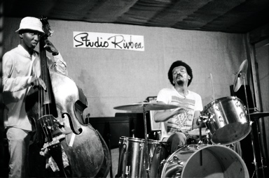
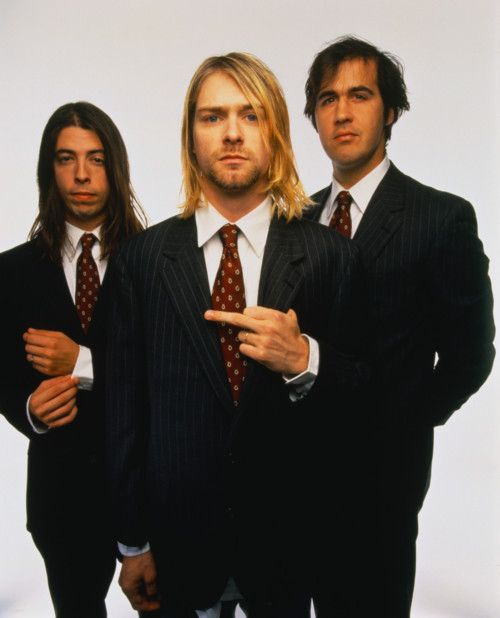
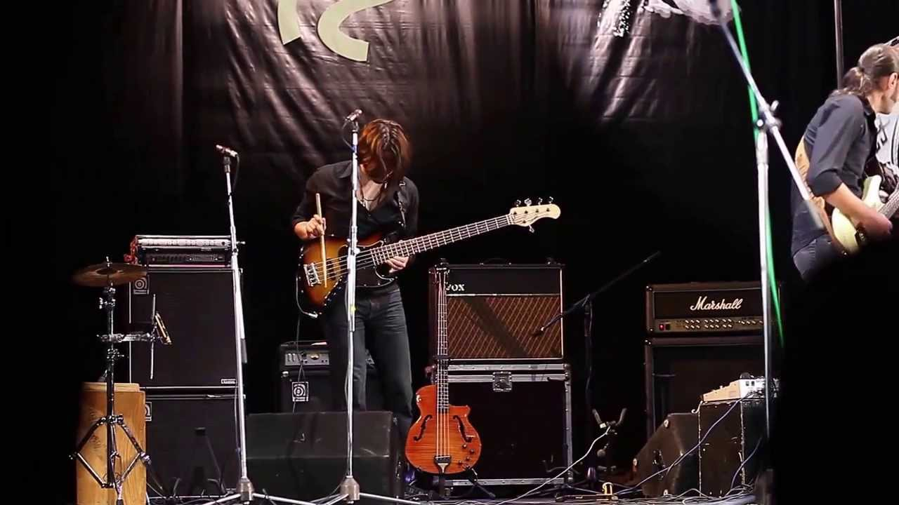

title: Programming as analogy. Rubymeditation
author:
  name: Джон, просто Джон
  github: sudodoki
  twitter: sudodoki
theme: sudodoki/reveal-cleaver-theme
output: index.html

--

# Programming as analogy
## Part II

--

> ## Это всего лишь аналогия. А любая аналогия условна.

--

# Software development = music

--

# Backend = rhythm section

--

# Frontend = melody & other stuff

--

# If thought this way, then, some common things…

--

## BaaS
### Look ma, no Backend

--

## Enterprise-y team

--

## Hip team working on enterprise

--

## Full-stack developer

--

## Bad team that has great PR & pushing product

--

## Autotune = linters

--

## Backender doing Frontend

--

## Scaffolded/generated backend

--

## Backend not keeping up with the spec

--

## Burnout aka too much work

--

## Creating fancy frontend demo for customer

--

## Orchestration

--

## Whenever there are breaking changes in backend

--

# Different languages = different instruments
## 🎹🎷🎺🎸🎻
--

# Different music styles = different type of projects

--

# Computer Science = Music theory
# ♩♪♫♬♭♮♯
--

# Patterns = scales, chords, …

--

# Go on and create nice music!
## 🎹🎤🎧🎼🎷🎺🎸🎻

--

# [The Passionate Programmer](https://pragprog.com/book/cfcar2/the-passionate-programmer)
