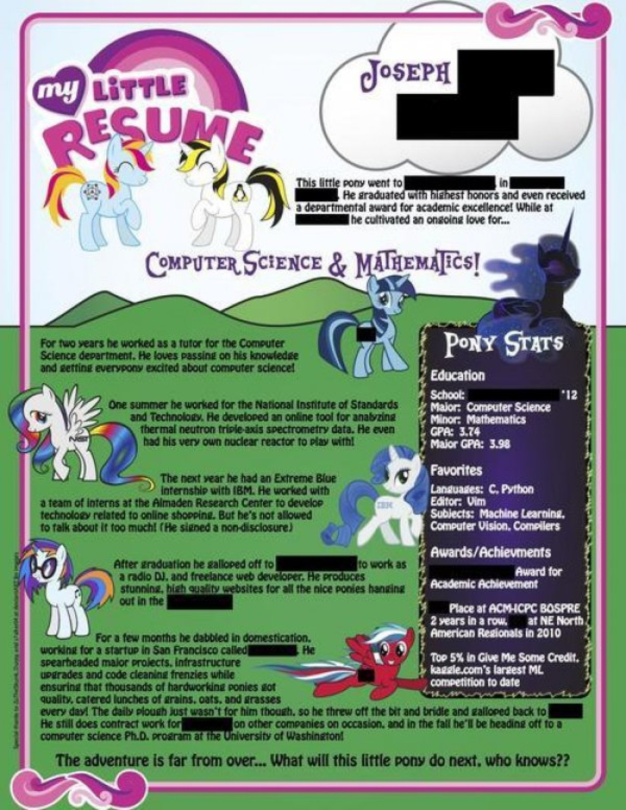

title: SE CONF 2015
author:
  name: sudodoki
  twitter: sudodoki
output: index.html
theme: sudodoki/reveal-cleaver-theme

--

## Киев работа без регистрации и смс: повышаем шансы
## [http://git.io/vnTDt](http://git.io/vnTDt)

--
<style>
  .plain-image img {
    background: transparent!important;
    border: none!important;
  }
</style>
## Джон, просто Джон
## [@sudodoki](http://twitter/sudodoki)
#### Александр Лапшин
<div class="plain-image">

</div>
--

## Ваши ожидания


--

## Ожидания работадателя
+ Свежая кровь
+ Способный
+ Пылкий
+ Ответственный

--

# У работадателя огромный выбор

--



--

# Краткость – сестра таланта

--

# В паблике

--

# Не знаешь – не пиши

--

# Engrish – advunced

--

# Адаптируем под вакансию
## Cover letters

--

# PDF

--

```
∘ Love of details.
∘ systematic
∘ skills: good with robohorses, computers.
∘ other skils: beginner C#
```

--

## Я ничего никогда не делал, но хочу, чтобы вы обратили на меня внимание

--

### Что делать?
+ open source
+ (почти) не связанные скиллы
+ курсы

--

## Качаться!
+ **English**
+ Hardskills
+ Softskills

--

# Интервью
+ говорим честно
+ спрашиваем про менторство
+ спрашиваем про плюшки

--

# Общество и связи

--

## Познакомьтесь с соседом

-- 

# Котаны


--

# Связи – важны

--

# Сходите на ивент

--

# Выступите на ивенте
+ [KyivJS](http://kyivjs.org.ua)
+ [Kyiv.py](http://www.meetup.com/uapycon/)
+ [Kiev Clojure](http://www.meetup.com/Kiev-Clojure-Users/)
+ [RubyMeditation](https://twitter.com/RubyMeditation)
+ […](http://www.meetup.com/find/events/tech/?allMeetups=true&radius=100&userFreeform=Kyiv%2C+Ukraine)

--

# [DOU](http://dou.ua)

--

# Чатики-чаты
+ [mr-mig/ru-it-chats](https://github.com/mr-mig/ru-it-chats)
+ [github.com/dev-ua](https://github.com/dev-ua/)

--

# Полезные линки:
+ [36 – Вадим Макишвили](https://www.youtube.com/watch?v=xPPCzryZK44)
+ [Making Badass Developers - Kathy Sierra](https://www.youtube.com/watch?v=FKTxC9pl-WM)

--

## Самое главное: будьте няшей!
# ^_^

--

# Вопросы?
## [http://git.io/vnTDt](http://git.io/vnTDt)
## [@sudodoki](http://twitter/sudodoki) 
